# Strategy OS backend intelligence

Date: 2026-08-31
Baseline: `codex/execution-foundation` at `de6faae3e97cf5537338bee2143350e53f70da1c` plus inherited dirty bytes
Purpose: internal navigation and diagnosis; no release or deployment claim

## Start here

- [Chat 1 Kleppmann handoff](../../research/professional-engineering-v5/12-KLEPPMANN-REAUDIT-HANDOFF-FOR-CHAT-2.md)
- [Broader source catalog](../../research/professional-engineering-v5/13-BROADER-SOURCE-CATALOG.md)
- [Source-to-code matrix](../../research/professional-engineering-v5/19-SOURCE-TO-CODE-MATRIX.md)
- [Confirmed risk register](../../research/professional-engineering-v5/21-CONFIRMED-BACKEND-RISK-REGISTER.md)
- [Implementation gate](../../research/professional-engineering-v5/22-IMPLEMENTATION-CANDIDATE-GATE.md)
- [Future release seams](../FUTURE-RELEASE-BACKEND-SEAMS-AND-ADOPTION-TRIGGERS.md)
- [Scale and measured triggers](../SCALE-50-TO-10000-MEASURED-TRIGGERS.md)
- [Current programme pointer](../../agent/CURRENT.md)

## Product and system context

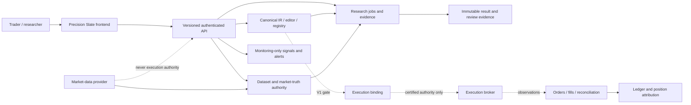

V0 ends at research/evidence and monitoring-only alerts. Execution, broker, capital,
orders, positions and money are present as protected foundations but remain denied
to the public V0 profile.

## Current process and deployment topology

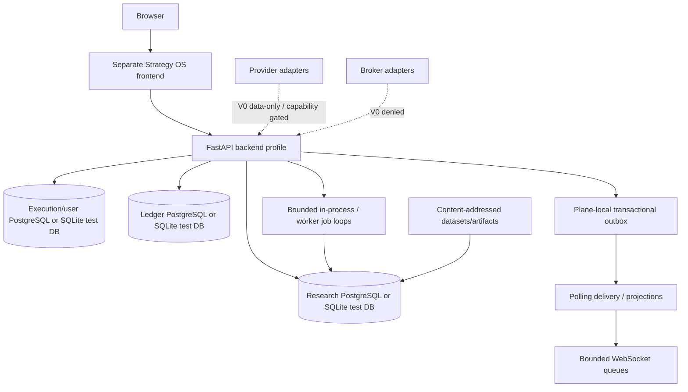

No Kafka, Redis, workflow service, analytics database, service mesh or Kubernetes
is part of the accepted topology. The canonical deployment script remains
`paper-trader/scripts/deploy.sh`; this document does not authorize running it.

## Strategy lifecycle

```mermaid
flowchart LR
    Draft[Owned graph draft] --> Edit[Canonical semantic/presentation edits]
    Edit --> Validate[Validator]
    Validate --> Resolve[Pure resolver + component closure]
    Resolve --> Publish[Immutable graph version]
    Publish --> Admit[Research admission]
    Admit --> Plan[Canonical ResourcePlan]
    Plan --> Experiment[ExperimentSpec + durable job]
    Experiment --> Evidence[Trials / folds / result / review]
    Evidence --> Monitor[Monitoring-only admission]
    Monitor --> Signal[Signal transition / alert]
    Signal -. V1 transaction-time gates .-> Execution[Execution binding]
```

Current gap: published-graph experiments do not consume or persist the accepted
`ResourcePlan`. The V0 legacy sweep also bypasses this canonical journey.

## Dataset and market-truth lifecycle

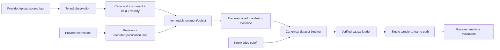

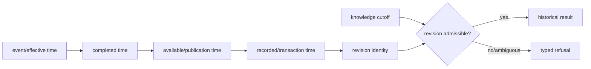

For a completed observation, `available_at < completed_at` is invalid unless the
producer uses a separately declared forming-snapshot contract. The current Q03 path
is narrow and contained; broad real-provider capture is not proved.

## Sources of truth and derived state

```mermaid
flowchart TB
    subgraph Durable authority
      Graph[Graph/version/admission]
      Dataset[Dataset/manifest/provider evidence]
      Spec[Experiment spec/trials/results]
      Intent[Execution intent/attempt]
      Raw[Raw order/fill observations]
      Position[Exact position/tranche ownership]
      Ledger[Ledger events]
      OutboxFact[Transactional outbox fact]
    end
    subgraph Rebuildable or volatile
      Frame[DataFrame/materialization]
      Cache[Evaluation/read cache]
      Runtime[Incremental runtime state]
      Projection[API/WebSocket projection]
      Metrics[Metrics/logs/traces]
    end
    Graph --> Runtime
    Dataset --> Frame --> Cache
    Graph --> Spec
    Dataset --> Spec
    Raw --> Position --> Ledger
    OutboxFact --> Projection
    Durable authority --> Metrics
```

Derived state may accelerate or explain authority. It never replaces authority.
Loss must cause deterministic rebuild or a visible degraded/unavailable state.

## Research job lifecycle

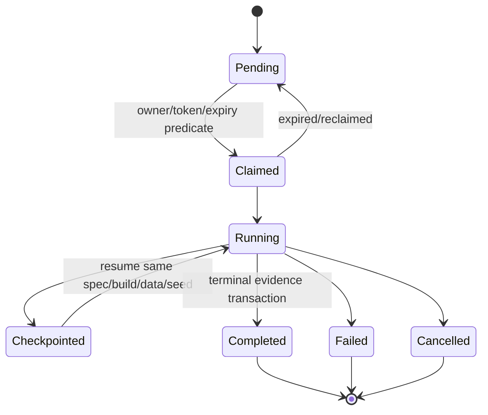

Claim and stale-write predicates exist, but the final current-tree SQLite race test
does not terminate inside 45 seconds and PostgreSQL process-kill/takeover remains
unproved. Do not call this lifecycle release-ready.

## Research selection and evidence boundary

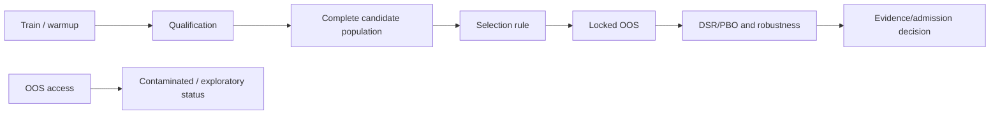

Current legacy `run_experiment` violates this sequence by passing full history to
qualification before later OOS validation. Old evidence must not be relabelled.

## Signal, authority, order, fill and reconciliation lifecycle

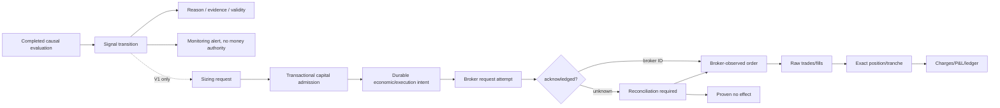

Transport timeout is not rejection. A cancel/complete observation sequence currently
can produce a contradictory `CANCELLED` full fill; this is a V1 execution defect.

## Provider capability and preflight flow

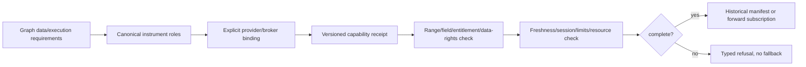

Provider names, tokens and quirks stay at adapters. A configured but unknown provider
must never fall through to Mock. Current provider pages do not prove conformance,
historical rights or actual account behavior.

## Failure, degraded and recovery states

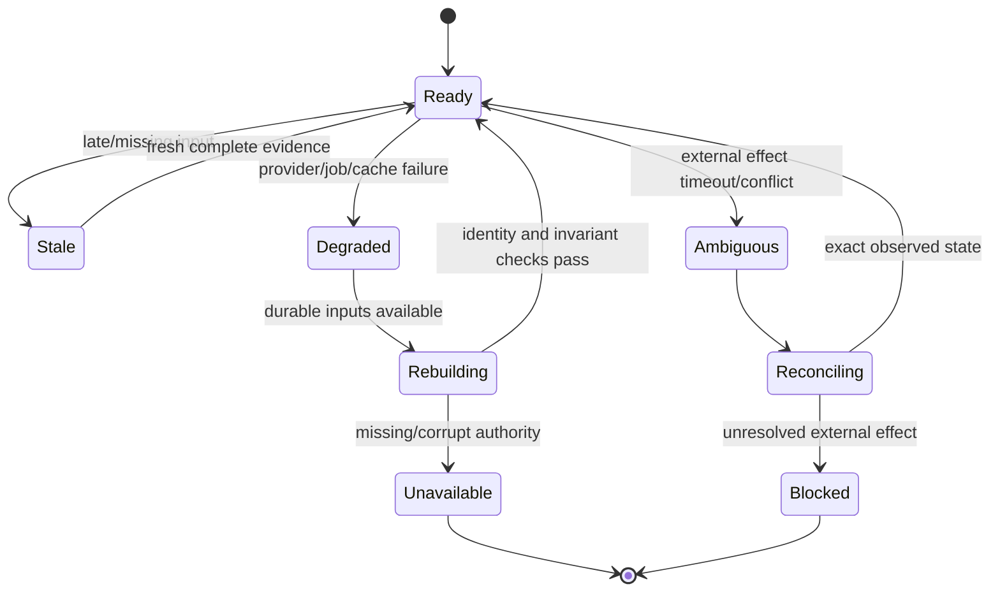

Degraded mode must not change provider, data, fill or research semantics. Entry
authority fails closed; authorized risk-reducing exits remain available in future
execution profiles.

## Tenancy and security boundaries

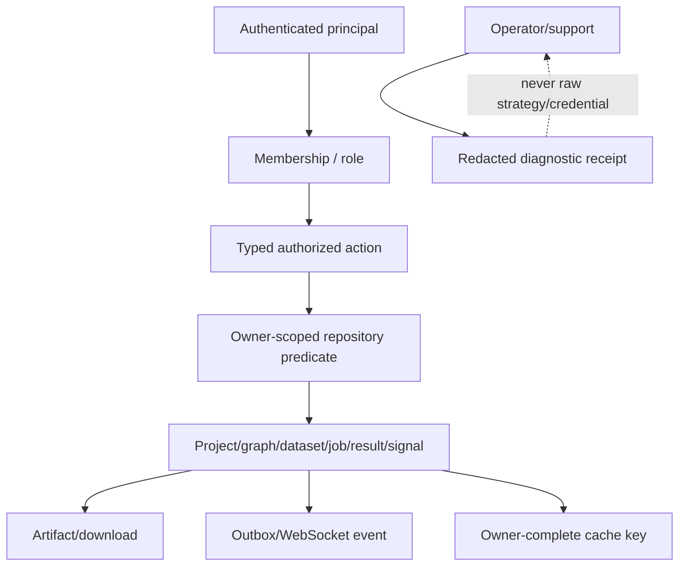

Positive same-owner controls and unrelated-owner/private-absence tests are required
for every affected surface. Authentication alone is never object authorization.

## Release and scale sequence

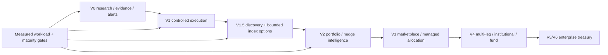

V1.1 is retired. Dynamic Watchlists belong to V1.5 under the accepted 29 August
reconciliation. No later box grants implementation authority.

## Subsystem diagnosis

Status vocabulary:

```text
PROVEN WORKING
PROBABLY WORKING BUT UNDER-TESTED
PARTIAL
PLACEHOLDER / NOT INTEGRATED
DOCUMENTATION-ONLY
BROKEN
UNKNOWN
DEFERRED BY DESIGN
```

| Subsystem | Code/source of truth | Inputs/outputs and invariant | Failure/debug entry | Current status |
| --- | --- | --- | --- | --- |
| Auth/session/tenant seam | `app/api/principal.py`, user/membership/session repositories | Server-derived principal/owner; private absence; CSRF/origin/session revocation | Synthetic A/B HTTP tests, membership/session events | `PROBABLY WORKING BUT UNDER-TESTED`; active-socket revocation unspecified |
| Canonical IR/editor | `app/ir`, `app/editor`, graph/version/admission rows | One language/registry/validator/resolver/hash; immutable graph identity | Corpus, resolution, edit/version and mutation gates | `PROVEN WORKING` for accepted bounded catalogue; active frontend integration changes continue |
| ResourcePlan | `app/ir/resource_plan.py` | One plan/policy/calibration; unknown demand refuses | Plan characterization and nine F03 consumers | `PARTIAL`; graph research bridge is `BROKEN` |
| Market truth/observations | `app/market_truth`, `app/market_data` | Canonical physical identity, causal times, validity and provider evidence | Prefix/availability/revision fixtures | `PARTIAL`; impossible completion/availability ordering accepted |
| Q03 canonical dataset bridge | `research/data/canonical_dataset.py`, persisted manifests | Exact one-series NSE/BSE cash 15/30/60m path; no provider fetch/gaps/corrections | Accepted Q03 tests and reopen | `PROVEN WORKING` only for declared narrow scope |
| Legacy backtest sweep | `app/api/backtest_routes.py`, `app/backtest/universe.py` | Standard-profile legacy path; must be denied in V0 | Release-policy RED before dispatch | `BROKEN` V0 boundary |
| Experiment spec/result identity | `research/orchestrator/run.py`, `research/domain/models.py` | Exact graph/data/cost/method/search/seed evidence | Forced collision and restart reconstruction | `PARTIAL`; byte-equality guard absent and optimization reconstruction incomplete |
| Research validity | `research/pipeline`, `research/stats` | Selection-free OOS, complete trial population, explicit method assumptions | OOS suffix mutation, DSR/PBO reconstruction, dependent trades | `BROKEN` confirmatory OOS; other methods `PARTIAL/UNKNOWN` |
| Backtest/research jobs | repositories and operation rows | Durable claim/token/expiry, retry/cancel/checkpoint/finalize | Isolated race, kill/restart and PostgreSQL takeover | `PARTIAL`; current race gate times out |
| Outbox/realtime projection | `app/events/outbox.py`, `delivery.py`, `app/ws/manager.py` | Transaction-bound fact, at-least-once projection, bounded queue | Lost wakeup, duplicate effect, cursor/resync, revoke socket | `PROBABLY WORKING BUT UNDER-TESTED`; full restore/revocation open |
| Monitoring/alerts | programme-owned monitoring capsules | Signal transition distinct from alert/delivery/attention | Restart/dedup/cooldown/stale/review tests | `PARTIAL`; active V0 work outside this packet |
| Provider adapters | `app/providers`, broker/data capability contracts | Canonical identity outside adapter; explicit capability/refusal | Provider-specific fixtures, rate/reconnect/semantic-change | `PARTIAL`; no real conformance/data-rights proof |
| Execution lifecycle | `app/engine/execution_lifecycle.py`, attempts/orders/fills | Raw events immutable; coherent terminal/reconciliation state | Cancel/fill/duplicate/out-of-order property tests | `BROKEN` terminal conflict; `DEFERRED BY DESIGN` from V0 |
| Capital admission | `app/execution/capital_admission.py`, reservations/recovery | One deterministic fenced predicate; risk reduction exempt | PostgreSQL simultaneous/restart/unknown-submit | `PLACEHOLDER / NOT INTEGRATED`; foundation exists |
| Position and ledger attribution | execution/position/ledger rows and services | Exact strategy/deployment/revision/tranche; full charges; no duplicate effects | Partial close/netting/reconciliation/conservation | `PROBABLY WORKING BUT UNDER-TESTED`; no live claim |
| Database migration/restore | execution/research/ledger migrations and restore contracts | Expand-contract, exact heads, backup/restore/reconstruction | Zero/current-state migration, rollback, three-plane restore | `UNKNOWN` for current release environment |
| Frontend product journey | separate `/Users/priyanshusaraf/dev/strategy-os-frontend` | One typed client over canonical facts; explicit Unknown/error/refusal | Type/test/build and safe browser journey | `PARTIAL`; concurrently owned by V0 convergence task |
| Scale/capacity | ResourcePlan, workers, DB pools and measurement receipts | Admission from measured demand; no user-count architecture | [Scale trigger document](../SCALE-50-TO-10000-MEASURED-TRIGGERS.md) | `UNKNOWN`; no production-shaped baseline |

## How to debug without creating false evidence

1. Read `CURRENT.md`, matching programme stage and exact capsule.
2. Freeze hashes and attribute inherited bytes before mutation.
3. Identify the durable source of truth and its identity.
4. Reproduce one concrete failure with a small fixture or concurrent history.
5. Keep source principle, repository observation and inference separate.
6. Run focused checks from the documented entry point and keep failed harness logs.
7. Do not infer PostgreSQL, provider, browser, restore or deployment behavior from
   SQLite/unit tests or prose.
8. Stop at live, money, schema, dependency, provider, deployment and legal gates.

## Known next steps

1. Serialize V0 correction capsules for OOS isolation, legacy-route denial and the
   existing F03 ResourcePlan bridge.
2. Add collision-safe experiment recipe comparison under a separate identity slice.
3. Reconcile the inherited claim-race timeout before relying on job fencing.
4. Complete reports 23–25 after authorized implementation decisions are known.
5. Run the exact release/security/deployability matrices before any release claim.
