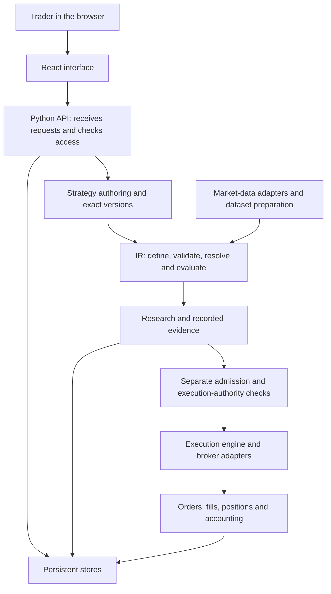

# Strategy OS: owner walkthrough

Date: 28 August 2026. Status: first-session orientation, not a complete feature audit.

This is a supplemental teaching document requested by the owner. It does not replace the active V0 release-audit capsule, complete its required package, change the programme, or authorize implementation. Product, frontend, databases, credentials and deployment remain untouched.

## 1. What we are trying to achieve

You should be able to choose a feature and explain:

1. What the trader asks it to do.
2. Which code receives the request and which code makes the decision.
3. Which data and exact strategy version it uses.
4. What it stores, who owns that data, and what survives a restart.
5. What it is allowed to do, including what it must refuse.
6. How it would run in a deployed system and what drives its cost.
7. What evidence would convince you it works, and what would disprove that claim.

We will build understanding in layers. Memorizing filenames is not the objective. Being able to trace behavior, question an assumption, and demand a useful test is.

Agents can write code. People still own requirements, risk limits, architecture decisions and acceptance. Reading explanations helps, but it does not replace independent engineering review or operational testing.

## 2. Learning sequence

These are lessons, not implementation capsules. We can slow down wherever a concept is unfamiliar.

| Order | Topic | What we will produce or demonstrate |
| --- | --- | --- |
| 1 | System design | The trader's workflow, major responsibilities, data movement and failure boundaries. |
| 2 | Architecture choices | Why boundaries exist; the alternatives, tradeoffs, history and evidence behind each decision. |
| 3 | Deployment and economics | Actual processes versus folders; possible hosting layouts; fixed and usage costs; what still lacks an accepted deployment plan. |
| 4 | Reading the code | Python/TypeScript basics as needed, then trace one request from screen to API to domain logic to storage and response. |
| 5 | SQL and PostgreSQL from zero | Tables, rows, columns, keys, SELECT, WHERE, JOIN, aggregation, NULL, INSERT/UPDATE/DELETE, constraints and transactions, using disposable teaching data. |
| 6 | Our database implementation | Configuration, SQLAlchemy, connection pools, execution/research/ledger stores, migrations, ownership, indexes, backups and restore. |
| 7 | The IR in depth | Authoring, types, graph structure, component versions, validation, resolution, hashing, evaluation, causality and data lineage. |
| 8 | Safety and operations | Entry authority, exits, paper/live separation, duplicate work, crashes, recovery, tenant isolation, numerical accuracy and observability. |
| 9 | Feature-by-feature coverage | Apply the same trace to every declared capability, including features that exist only partly or remain planned. |

For each lesson: explain the idea, inspect a small piece of actual code, work through an example, ask an owner question, and record any unresolved claim. We will maintain coverage rather than treating one large answer as complete understanding.

The team reference should eventually contain a feature inventory, system diagram, database map, architecture-decision index, deployment/cost worksheet, glossary and findings register. This document starts that reference; those deliverables are not all complete.

## 3. First lesson: the system's responsibilities

A useful first approximation is:



This is a responsibility diagram, not proof that the whole workflow is enabled, production-ready or currently deployed. Market observation and trade execution also have different provider roles. An adapter is code that translates between Strategy OS's concepts and an external service's interface.

**The interface** displays information and collects intent. It must not become the final authority merely because a button is visible or hidden.

**The API** is the set of requests the backend accepts. It identifies the caller and routes a request to the code responsible for it.

**Domain code** implements product rules: publishing an exact graph, evaluating research, checking an assignment, or recording an order.

**Storage** holds records needed later. A running process's memory disappears when that process stops; persistent storage is how the system remembers.

**Execution authority** answers whether a particular account may act on a particular strategy in a particular mode. A successful calculation does not answer that question.

### Three different boundaries

A **folder** groups source files. A **process** is a running program. A **host** is the machine running processes. One folder does not imply one process or one paid server.

Strategy OS has a shared Python backend, not an independently deployed service for every feature. Its [startup code](/Users/priyanshusaraf/dev/options-trading/.claude/worktrees/codex-execution-foundation/paper-trader/backend/app/main.py:223) supports different roles: in automatic mode SQLite hosts the execution runner, while PostgreSQL defaults to an API-only replica. An explicit worker requires owner/account assignment. Those are code branches, not a verified production topology.

The [research worker command](/Users/priyanshusaraf/dev/options-trading/.claude/worktrees/codex-execution-foundation/paper-trader/backend/scripts/run_research_worker.py:53) is explicitly a safe local tool and refuses production mode. It must not be presented as the finished production worker deployment.

### One example to keep in mind

Suppose a trader asks: “Produce a signal when the completed candle closes above a moving average.”

We need to distinguish the rule, the precise moving-average definition, the input candles, the result, and permission to act on it. Changing the average's period changes the rule. Receiving corrected candle data changes the evidence. Granting account permission changes authority. Moving a node on the screen should change only presentation.

This is why “the strategy” cannot be one database row that silently changes meaning everywhere.

## 4. Initial code map

These locations exist and were used to orient the walkthrough. This table is not a completeness or correctness verdict for their contents.

| Location | What to look for |
| --- | --- |
| [frontend/src/App.tsx](../../../frontend/src/App.tsx) | Main application shell and named tabs. |
| [frontend/src/views](../../../frontend/src/views) | Screens such as Watchlist, Backtests, Strategy Graph and Settings. |
| [frontend/src/lib/api.ts](../../../frontend/src/lib/api.ts) | Browser request functions and response types. |
| [frontend/src/state/LiveContext.tsx](../../../frontend/src/state/LiveContext.tsx) | Browser integration with live status updates. |
| [backend/app/main.py](../../../backend/app/main.py) | FastAPI setup, startup checks and process-role selection. |
| [backend/app/api](../../../backend/app/api) | HTTP entry points, request contracts and caller handling. |
| [backend/app/editor](../../../backend/app/editor) | Drafts, publication, graph versions and presentation state. |
| [backend/app/ir](../../../backend/app/ir) | The strategy language, registry, validator, resolver, identities and evaluators. |
| [backend/app/core](../../../backend/app/core) | Product coordination, configuration, deployments and execution binding. |
| [backend/app/market_data](../../../backend/app/market_data) and [market_truth](../../../backend/app/market_truth) | Market inputs, numeric checks, canonical instruments and data claims. |
| [backend/app/providers](../../../backend/app/providers) | External data and broker integrations. |
| [backend/app/backtest](../../../backend/app/backtest) | Backtest requests, datasets, workers, results and caching. |
| [backend/research](../../../backend/research) | Research orchestration, evaluation, evidence and its separate storage. |
| [backend/app/engine](../../../backend/app/engine) and [execution](../../../backend/app/execution) | Trading loops, broker operations, worker ownership and recovery mechanisms. |
| [backend/app/db](../../../backend/app/db), [app/ledger](../../../backend/app/ledger) and [backend/migrations](../../../backend/migrations) | Persistence, ledger subsystem and execution schema evolution. These names alone do not establish where every money fact lives. |
| [backend/tests](../../../backend/tests), [research_tests](../../../backend/research_tests), frontend test files | Assertions we must inspect and, when appropriate, run or challenge. |
| [scripts/deploy.sh](../../../scripts/deploy.sh) | The only sanctioned deployment entry point; do not run it during teaching. |
| [docs/engineering/decisions](../../engineering/decisions) | Historical architecture decisions; check whether later code and decisions supersede them. |
| [docs/agent/CURRENT.md](../../agent/CURRENT.md) | Current work and authority boundaries. |

The current shell names twelve tabs. Portfolio visibility depends on the research-enabled flag; Backtests has a desktop-only presentation branch. Those observations describe the shell, not twelve finished products. We have not verified the browser flows in this session.

Also, the name “paper-trader” is historical. It must not make us assume that everything beneath it is incapable of live trading.

## 5. Database orientation before the SQL lessons

A **database** stores organized records. A **table** groups one kind of record. A **row** is one record; a **column** is one field. A **key** identifies a row or connects it to another record.

**SQL** is the language used to ask a relational database for data and request changes. **PostgreSQL** is a database server that processes those requests. Our Python code often uses **SQLAlchemy**, a library that constructs database operations from Python. The Python model is not the database itself.

For example, a future toy lesson could ask:

```sql
SELECT name
FROM lesson_strategies
WHERE owner_id = 'alice';
```

That means: return the name column from the teaching table for rows belonging to Alice. This is illustrative SQL, not a query against the actual Strategy OS schema, and it has not been executed.

PostgreSQL is a separate server process; applications can connect from the same machine or another machine. See the [official architecture introduction](https://www.postgresql.org/docs/16/tutorial-arch.html).

A **transaction** groups database changes so that they commit together or are rolled back together. It does not automatically make an external broker order atomic with a database update. That second problem needs its own recovery design. See the [official transaction tutorial](https://www.postgresql.org/docs/16/tutorial-transactions.html).

### Why PostgreSQL entered this codebase

The historical [ADR 0014](../../engineering/decisions/0014-sqlite-until-topology-forces-postgres.md) initially deferred migration. Its reasons for revisiting the decision included multiple hosts, multiple application replicas, concurrency and operational recovery. It explicitly rejected “we have 500 users” as sufficient evidence on its own.

That distinction is technically sound: SQLite stores a local database and permits one writer at a time per file. PostgreSQL supplies a server that multiple clients can use. Neither choice makes application logic correct. SQLite's own [selection guidance](https://www.sqlite.org/whentouse.html) explains these boundaries.

Current code goes beyond that old deferral: production mode requires explicit PostgreSQL URLs. We have not reconstructed every intervening approval, compared every alternative database, or inspected any deployed configuration.

### What the current configuration actually says

| Responsibility | Environment setting | Source |
| --- | --- | --- |
| Execution/application store | PT_DATABASE_URL | [app/db/engine.py](/Users/priyanshusaraf/dev/options-trading/.claude/worktrees/codex-execution-foundation/paper-trader/backend/app/db/engine.py:10) |
| Research store | PT_RESEARCH_DATABASE_URL | [research/config.py](/Users/priyanshusaraf/dev/options-trading/.claude/worktrees/codex-execution-foundation/paper-trader/backend/research/config.py:27) |
| Ledger subsystem store | PT_LEDGER_DATABASE_URL | [app/ledger/config.py](/Users/priyanshusaraf/dev/options-trading/.claude/worktrees/codex-execution-foundation/paper-trader/backend/app/ledger/config.py:29) |
| Enforce the production database profile | PT_PRODUCTION | Each URL resolver above rejects missing or non-PostgreSQL production authority. |

Local SQLite fallbacks remain. Startup checks distinct database authorities, including research when enabled. The development [PostgreSQL Compose file](../../../docker-compose.postgres.yml) specifies PostgreSQL 16; it is not an accepted complete production topology.

There is also a logical classification of tables as **market**, **user** or **money** in [app/db/planes.py](/Users/priyanshusaraf/dev/options-trading/.claude/worktrees/codex-execution-foundation/paper-trader/backend/app/db/planes.py:30). Those classifications are different from the three configured execution/research/ledger stores. Do not map them one-to-one or assume three separate physical servers.

A later lesson will map actual tables, schema namespaces, roles, connections and ownership. No database contents or migration heads were queried in this session.

## 6. The IR: what exists and what it does not prove

IR means **intermediate representation**: a structured description between what the trader authors and what the evaluator runs.

| Part | Beginner explanation | Source |
| --- | --- | --- |
| Schema | Which fields, types and connections the language permits. | [schema.py](../../../backend/app/ir/schema.py) |
| Registry | Which component definitions and versions exist. | [registry.py](../../../backend/app/ir/registry.py) |
| Validator | Whether a document follows the language's rules. | [validate.py](../../../backend/app/ir/validate.py) |
| Resolver | Turn component references and wiring into a precise evaluation structure. | [resolve.py](/Users/priyanshusaraf/dev/options-trading/.claude/worktrees/codex-execution-foundation/paper-trader/backend/app/ir/resolve.py:208) |
| Hashing | Produce a fingerprint from canonical content. | [hashing.py](../../../backend/app/ir/hashing.py) |
| Runtime | Perform the calculations described by the resolved structure. | [runtime.py](/Users/priyanshusaraf/dev/options-trading/.claude/worktrees/codex-execution-foundation/paper-trader/backend/app/ir/runtime.py:127) |

Version 2 schema, resolution and evaluation code exist. The older editor publication function explicitly rejects v2 documents and points toward the explicit document API. This is a boundary to understand, not evidence that every v2 feature is exposed through the current UI. Compare [publish_draft](/Users/priyanshusaraf/dev/options-trading/.claude/worktrees/codex-execution-foundation/paper-trader/backend/app/editor/graph_artifacts.py:468) and the [document API](/Users/priyanshusaraf/dev/options-trading/.claude/worktrees/codex-execution-foundation/paper-trader/backend/app/api/product_object_routes.py:249).

The promise is traceability: know exactly what ran, with which components and data. A hash proves an identity relationship only to the extent that the relevant inputs are included. It does not prove a formula is accurate, a dataset is truthful, a backtest is useful, or an account is authorized.

The [execution-binding combinations](/Users/priyanshusaraf/dev/options-trading/.claude/worktrees/codex-execution-foundation/paper-trader/backend/app/core/execution_binding.py:78) include an authoritative paper IR case and deliberately exclude authoritative live IR. Do not generalize that exclusion to all legacy live execution: handwritten/generated paths are separate.

## 7. Deployment and cost: the worksheet we need

The current [deployability verdict](/Users/priyanshusaraf/dev/options-trading/.claude/worktrees/codex-execution-foundation/paper-trader/docs/archive/release/DEPLOYABILITY.md:62) records named local evidence, rejects/openly leaves release deployability, and does not establish production rehearsal or authorization to deploy this tree. Historical paragraphs elsewhere in that ledger need to be reconciled before calling each listed blocker current.

For each feature, we will record its process, storage, dependencies, external services, failure behavior, deployment gate and operating cost.

| Feature area | Main cost drivers to measure |
| --- | --- |
| Editor and saved graphs | API traffic, version history, user storage and backups. |
| Historical research | Instruments × variants × bars, computation per bar, concurrency, dataset storage and cache reuse. |
| Continuous monitoring | Active instruments/contracts, update frequency, subscriptions and retained state. |
| Derivatives/depth features | Provider entitlements, contract fan-out, feed volume and historical-data availability. |
| Orders and reconciliation | Account workers, broker activity, durable events, recovery and operational support. |
| Shared platform | API/database baseline, backups, logs, monitoring, bandwidth and engineering operations. |

A useful starting model is:

**Monthly operating cost = shared infrastructure + compute usage + stored/served data + provider/licence charges + observability/backup services.**

Labour and support belong in a separate total-cost view; a hosting bill is not the whole cost of operating the product.

We must separate **incremental feature cost** from its **allocated share of common infrastructure**. Otherwise ten features appear to need ten database subscriptions.

No current per-feature currency estimate is established here. We need workload assumptions, retention, concurrency, provider rights, region and dated vendor prices. Old dollar estimates in an ADR are historical assumptions, not current quotes. We will cost concrete scenarios rather than invent precision.

## 8. Findings and limits of this walkthrough

### Existing finding: indicator accuracy

The [existing audit report](../../../../.agent/runs/post-phase5-indicator-accuracy-audit/report.md) classifies 125 analytical components as 25 strict matches, 60 rejected and 40 unverified. We read that report; we did not rerun its numerical comparisons.

A current source check confirms that KAMA and EMA share the same calculation branch in [analytical.py](/Users/priyanshusaraf/dev/options-trading/.claude/worktrees/codex-execution-foundation/paper-trader/backend/app/ir/first_party/analytical.py:221). This is an existing finding, not a discovery credited to this walkthrough.

Owner lesson: deterministic results can be consistently wrong. Tests can repeat an implementation's mistaken assumptions. Independent reference definitions matter.

Disposition: retain the existing indicator-correction owner gate and V0 audit dependency. No correction is authorized here.

### Newly observed behavior: the legacy dataset hash omits volume

The real [research data-store function](/Users/priyanshusaraf/dev/options-trading/.claude/worktrees/codex-execution-foundation/paper-trader/backend/research/data/store.py:41) hashes timestamp and open/high/low/close, not volume.

A local probe called the real materialization path twice with identical timestamps and prices but volumes 100 and 900. Both returned the same dataset content hash. The probe imported no application settings, app bootstrap or database session and used no provider/network.

Evidence: [probe source](../../../../.agent/runs/strategy-os-v0-release-audit/owner-walkthrough-2026-08-28/dataset_identity_probe.py) and [successful output](../../../../.agent/runs/strategy-os-v0-release-audit/owner-walkthrough-2026-08-28/dataset-identity-probe.log).

The research [dataset identity record](/Users/priyanshusaraf/dev/options-trading/.claude/worktrees/codex-execution-foundation/paper-trader/backend/research/orchestrator/run.py:128) includes that hash. However, [graph provenance](/Users/priyanshusaraf/dev/options-trading/.claude/worktrees/codex-execution-foundation/paper-trader/backend/research/orchestrator/graph_experiment.py:74) also computes a separate data digest. We have **not** proved a stale cache hit, incorrect final research result, affected canonical v2 admission, or live impact.

Disposition: V0 release-audit owner must trace which consumers rely on this hash alone, whether volume can affect their outputs, and whether another identity closes the gap. Any repair needs an explicit implementation capsule and compatibility decision. This is not a claim of a cryptographic hash collision; a field was never included.

### Newly observed documentation drift

The [planes module introduction](/Users/priyanshusaraf/dev/options-trading/.claude/worktrees/codex-execution-foundation/paper-trader/backend/app/db/planes.py:10) says all planes currently live in one SQLite file. Current startup and configuration support distinct authorities and PostgreSQL. Also, the [IR dispatch docstring](/Users/priyanshusaraf/dev/options-trading/.claude/worktrees/codex-execution-foundation/paper-trader/backend/app/ir/formats/dispatch.py:14) describes v2 as not selected while its condition accepts both versions.

These comments can mislead someone learning the code. They do not alone prove runtime failures. The V0 audit should reconcile historical explanations with current behavior; this walkthrough did not edit protected product files.

### Evidence discipline for future lessons

Keep these statements separate:

- **Intended:** the design says it should work this way.
- **Implemented:** the responsible code exists.
- **Connected:** the actual user or worker path reaches it.
- **Verified:** a named test or observation supports a specific claim on known code.
- **Released/deployed:** the required release gates and deployment evidence exist.

A feature can pass one level and fail the next. Test counts, filenames and confident comments do not bridge the gap.

## 9. Where to continue

Next: follow “save and publish a graph” through the current interface, API, ownership checks, immutable version, admission and database write. First explain every new programming term. Then examine the explicit v2 document path and its difference from the legacy publication path.

Owner questions for that lesson:

1. If a node moves on screen, should research results become a different strategy's results?
2. If the formula or an input dataset changes, what evidence must be invalidated?
3. If publishing succeeds, what has it authorized, and what has it not authorized?
4. If two people edit the same draft, how should the system avoid silently losing one edit?
5. If storage fails midway, what must exist together and what must not exist at all?

Session evidence is under [owner-walkthrough-2026-08-28](../../../../.agent/runs/strategy-os-v0-release-audit/owner-walkthrough-2026-08-28). This first pass used source inspection and one isolated function probe. It did not run the full test suite, start the application, inspect the live VPS, access credentials, change product code or establish safety/readiness.
