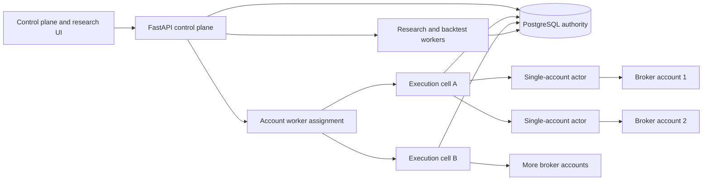

# Execution-first product roadmap

**Date:** 2026-08-09  
**Branch:** `codex/execution-foundation`  
**Starting commit:** `072eb8f36d3a456bce3b0812db9c183b2e669099`  
**Decision rule:** reject every performance, safety, and product claim until a test, persisted record, benchmark, or failure drill proves it.

## 1. Outcome

Strategy OS will first become a trustworthy execution and research engine. It will then become an approachable product for a novice trader. Broker breadth and customer administration will follow once the core proves that it can preserve money state, prevent causal contamination, reproduce research results, and operate under realistic concurrent load.

The immediate order of work is:

1. Make entry-order intent durable before any broker call and record order observations as immutable events.
2. Make future-data access unavailable to strategies created inside Strategy OS.
3. Make backtest cache reuse content-addressed, correct, and fast.
4. Separate market-data, execution, account, and instrument-resolution roles without adding another broker yet.
5. Move execution into account-isolated workers and prove the first 100-user topology under load.
6. Turn the existing React frontend into a guided research product for novice traders.
7. Add broker adapters through the proved role boundary.
8. Add customer authentication, ownership enforcement, and commercial administration before opening the product to external users.

## 2. Scope decisions

### Immediate scope

- Durable entry intent, acknowledgement, observations, fills, latency, and realised slippage.
- Crash recovery that refuses a second submission while the first result remains uncertain.
- A causal strategy contract for graph-built strategies.
- Reproducible backtest datasets, model versions, cost settings, and cache keys.
- Measured 100 instruments by 5 intervals backtest performance.
- A deployment design for 100 users with a credible path to 1,000.
- A novice research journey built on the existing frontend after the backend gates pass.

### Deferred scope

- The Upstox adapter and other broker adapters.
- Live delivery, MTF, and futures products.
- Customer-facing authentication and complete tenant ownership.
- Microservices, Kubernetes, and a per-customer VPS fleet.
- A visual redesign before research and execution truth are stable.

Authentication is deferred as a product workstream, but account identity remains mandatory anywhere its absence could mix orders or money. Deployment work may therefore introduce internal account and connection identifiers before it introduces customer login.

## 3. Approaches considered

### Approach A: patch the mutable `OrderJournal`

This is the smallest diff. It could make journal creation fatal and add several columns. It would still overwrite aggregate state, lack immutable fill identity, and leave duplicate or out-of-order observations difficult to reason about. It also makes a legacy recovery table carry more responsibilities.

**Decision:** reject.

### Approach B: add an immutable lifecycle beside the legacy journal

New entry orders use a durable intent and append-only event stream. A pure reducer derives current state. Legacy journal rows remain readable for old orders and exits until later migrations move them. This gives the project a safe cutover boundary without rewriting exits or the ledger.

**Decision:** accept.

### Approach C: rewrite execution as a complete event-sourced engine

This could produce a clean end state, but it changes entries, exits, positions, reconciliation, notifications, and deployment at once. It raises live-money risk and delays evidence.

**Decision:** reject for now.

## 4. Target architecture

The first implementation remains a modular monolith on SQLite. The boundaries must still match the target:

- The control plane owns projects, strategies, deployments, research requests, and UI APIs.
- One account actor owns risk monitoring, entry and exit submission, reconciliation, and broker throttling for exactly one broker account.
- Research and backtests cannot consume the execution worker's latency or database budget.
- PostgreSQL becomes necessary before more than one execution host because account leases and fencing need a shared authority.
- Execution remains active-passive per account. Two workers must never submit for the same account at the same time.

## 5. Execution lifecycle design

### 5.1 Durable intent

Every new live entry receives a `client_intent_id` before a broker call. Strategy OS commits the complete economic instruction first:

- deployment and internal account/connection scope;
- broker and broker-visible correlation tag;
- canonical instrument key plus venue symbol and exchange;
- side, product, order type, quantity, and limit price;
- decision/reference price and signal timestamp;
- strategy and execution context needed for recovery;
- creation timestamp.

If this commit fails, the system refuses the entry and does not call the broker.

### 5.2 Append-only events

Order observations are immutable rows. The first vocabulary is:

- `INTENT_CREATED`
- `SUBMIT_STARTED`
- `ACKNOWLEDGED`
- `STATUS_OBSERVED`
- `RECONCILIATION_REQUIRED`

Each event carries a deterministic source-event identity. Replaying the same broker observation becomes a no-op. An observation may increase cumulative filled quantity but may never reduce it. A terminal state may not reopen. A broker order ID may not change after acknowledgement.

### 5.3 Failure behaviour

- Intent commit fails before submission: refuse the entry.
- `SUBMIT_STARTED` commit fails: refuse the entry.
- Broker call fails without an order ID: record the observation and allow a later new intent.
- Broker acknowledges but acknowledgement persistence fails: do not submit again. Keep the intent blocked in memory, raise a money-critical alert, and recover from the durable `SUBMIT_STARTED` plus broker-visible tag after restart.
- Polling fails: preserve the acknowledged order as unresolved and reconcile before another entry for the same scope.
- Duplicate or older broker observations: retain or deduplicate them without regressing derived state.
- Exit orders keep the current safety path in this slice. Risk reduction must not depend on the new entry store until a separate emergency-receipt design proves that persistence failure cannot trap an open position.

### 5.4 Slippage and latency

The intent stores the decision price and signal timestamp. Events store submit, acknowledgement, observation, and fill times. The reducer exposes:

- signal-to-intent latency;
- intent-to-submit latency;
- submit-to-acknowledgement latency;
- acknowledgement-to-fill latency;
- decision-to-fill slippage in price and basis points;
- fill progress and remaining quantity.

The system must not calculate realised slippage from the latest quote. It must use the immutable decision reference attached to the intent.

## 6. Look-ahead prevention

The application cannot make arbitrary Python causal. It can make strategies created inside Strategy OS causal by construction.

The authoritative user-created strategy format will be the closed Component IR graph. Every computation block must declare:

- its allowed inputs;
- its maximum historical lookback;
- whether it produces a value on the current completed bar or a later bar;
- that it has no negative shift, future join, centered window, or unresolved external series.

Graph validation rejects any component without a causal contract. The reference runtime advances one completed bar at a time and exposes only the current prefix. A vectorised runtime may optimize research, but it must produce byte-equivalent decisions to the streaming reference runtime on a prefix-equivalence suite.

Legacy handwritten strategies remain adapters. They cannot become a promoted user strategy unless they pass:

1. prefix-versus-full causality tests across adversarial fixtures;
2. reference-streaming versus vectorised equivalence;
3. a mutation test that injects a future read and proves admission rejects it.

Backtest execution keeps the existing next-bar-open rule. A decision on completed bar `t` can first fill on bar `t+1`. Protective models must state whether they use bar OHLC, next-open, or synthetic premium assumptions. They may not present synthetic stop fills as observed option execution.

## 7. Backtest truth and performance

Correct cache identity comes before faster reuse. A result identity must include:

- a content hash over ordered OHLCV rows, timestamps, provider, and dataset span;
- strategy key and immutable strategy version;
- graph content address when the strategy comes from Component IR;
- backtest model version;
- resolved slippage, charges, event-risk policy, and sizing settings;
- instrument, interval, and requested window.

Changing any older candle, strategy implementation, or execution-cost setting must cause a cache miss.

The 100 by 5 target receives an operation budget before a wall-clock promise:

- no more than 500 provider candle reads per explicit cold refresh, independent of strategy count;
- no more than 500 DataFrame conversions;
- one signal evaluation per dataset and selected strategy;
- zero provider reads on a warm rerun against the same immutable dataset;
- progress persistence every 10 cells rather than every cell;
- byte-identical results before and after performance refactors for a frozen dataset.

After measuring real-provider latency, the project will set cold and warm p50, p95, and p99 wall-time targets. Host CPU alone cannot define the budget because provider throttles and dataset fetches dominate the present sweep.

## 8. Deployment path

### First 100 users

Use one shared control plane and a small pool of account-isolated execution workers. Start with a maximum of five active accounts per worker process until load tests justify a higher cap. Spread workers across at least two hosts so one host failure does not stop every account.

Planning assumptions:

- 100 connected accounts, 50 concurrently live;
- 20 enabled instruments and 5 open positions per live account;
- 20 control-plane read requests per second, 5 writes per second, and 100 WebSockets at peak;
- dashboard p95 below 300 ms;
- price-to-risk-decision p95 below 2 seconds and an alert at 5 seconds;
- durable intent committed before every broker request;
- execution-state RPO below 60 seconds and recovery RTO below 15 minutes.

These are targets to prove, not descriptions of the current system.

Required failure drills include 50-account market-session soak, duplicate-worker fencing, crash-after-submit recovery, token expiry, database restore, cell failover, broker throttling, and partial/out-of-order fills.

### At 1,000 users

Group account actors into bounded execution cells. A cell has a version, resource limit, metrics, primary host, and standby placement. Consistent routing assigns each account to one cell. Failover requires a fencing token, journal replay, and broker reconciliation before the new worker accepts entries.

Add a message bus only for notifications, WebSocket fan-out, and cache invalidation. PostgreSQL remains authoritative for execution state and work ownership. Per-user VPS deployment remains an optional premium isolation mode, not the default architecture.

## 9. Research product and frontend

The repository already has a React/Vite frontend with graph, research, backtest, engine, portfolio, and ledger views. The later frontend workstream will test and reshape it around one novice journey:

1. Choose a market idea from guided examples.
2. Assemble a strategy from causal blocks with plain explanations.
3. See which inputs, filters, entry, exit, sizing, and risk rules are missing.
4. Run a small causal backtest with visible data, cost, and model provenance.
5. Compare in-sample and out-of-sample evidence without a single misleading winner score.
6. Iterate safely, then enter shadow and paper stages through explicit gates.

The UI must distinguish underlying backtests from synthetic option scenarios. It must not promote a one-trade result or hide dataset, strategy, slippage, cost, and live-parity assumptions.

Frontend work begins after execution and backtest contracts stabilize. This avoids teaching novices through interfaces whose underlying claims are still moving.

## 10. Delivery phases and gates

| Phase | Deliverable | Gate before moving on |
|---|---|---|
| 1 | Durable entry intent, immutable events, pure reducer | No broker call before committed intent; duplicate and older observations cannot double-book or regress state |
| 2 | Entry integration, recovery, latency, slippage | Crash-point tests pass; uncertain acknowledgement blocks resubmit; measured slippage uses decision price |
| 3 | Causal strategy contract | Injected future reads fail admission; streaming and vectorised runtimes agree |
| 4 | Correct content-addressed cache | Candle, strategy, or cost mutation forces cache miss; cached benchmark curve remains intact |
| 5 | Fast 100 by 5 sweep | Operation budgets pass; frozen outputs remain identical; warm rerun performs zero provider reads |
| 6 | Role bindings and account actor seam | Data and execution roles can differ in tests; current Kite-only runtime behaves identically |
| 7 | Deployable 100-user topology | 50-account soak and crash/fencing drills meet latency, RPO, and RTO targets |
| 8 | Novice research experience | A novice usability study completes idea-to-paper flow without developer help |
| 9 | More brokers | Adapter conformance and split-role tests pass with real sandbox or owner-provided credentials |
| 10 | Commercial access | Authentication, resource ownership, encrypted credentials, and cross-account isolation tests pass |

## 11. First implementation boundary

The first implementation plan covers Phase 1 only. It creates the schema, reducer, and storage service, then integrates new live entries without changing exit behavior. It preserves legacy `OrderJournal` recovery for old rows. It does not deploy, touch the live database, enable a product, or call a real broker.

## 12. Design self-review

- No placeholder or unspecified implementation decision remains in Phase 1.
- The roadmap separates execution, backtesting, deployment, and frontend into independently testable phases.
- The plan does not claim that arbitrary Python can be made causal.
- The deployment targets name assumptions, latency budgets, RPO, and RTO.
- Broker breadth and commercial tenancy remain deferred without removing the internal identities required for money safety.
