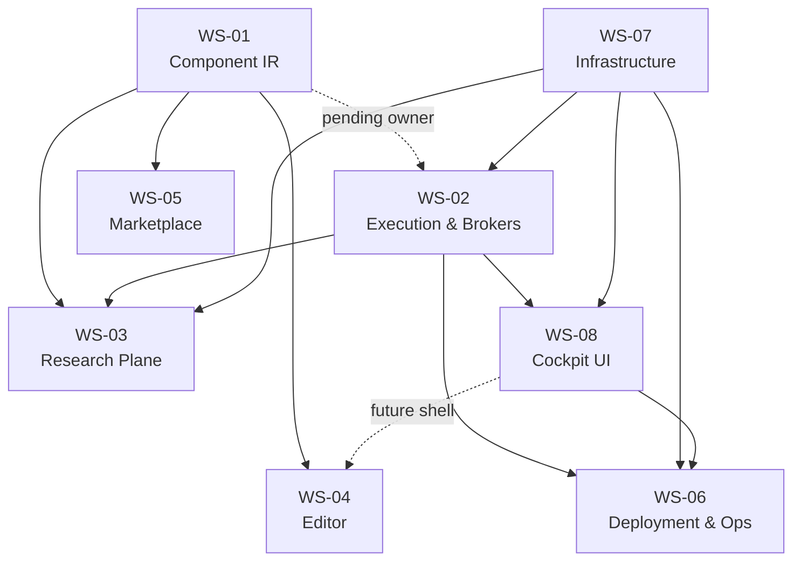

# DEPENDENCIES

The inter-workstream graph, derived from what each workstream declares in its §3. If an edge
here is not declared in both documents, one of the three is wrong.

Maintained by the executive layer. See [`EXECUTIVE.md`](EXECUTIVE.md) §7 for the checks.

---

## 1. The graph

An arrow means *the target consumes from the source*. Acyclic: WS-01 and WS-07 are roots,
WS-06 is a sink.

## 2. Edges, and what actually crosses them

| From | To | What crosses |
|---|---|---|
| WS-01 | WS-03 | `resolve`, `evaluate`, `edit`, `authoring`, `experiment`, `kernels` — the whole language |
| WS-01 | WS-04 | `graph_view`, `to_svg`, `Layout`, the edit functions |
| WS-01 | WS-05 | the component/kernel registry shape; C13 |
| WS-01 | WS-02 | **not yet** — RFC Appendix C(d), owner-blocked |
| WS-02 | WS-03 | strategy registry contract, `candles.py`, charges, the backtester |
| WS-02 | WS-08 | the REST + WS API, the money record |
| WS-07 | WS-02, WS-03, WS-08 | DB, sessions, `Settings`/`runtime_config`, the WS hub, test isolation |
| WS-02, WS-07, WS-08 | WS-06 | what gets deployed, and what `/api/health` reports |
| WS-08 | WS-04 | the app shell the editor will live in — a future edge, declared now so it is not discovered late |

## 3. Roots and sinks

**Roots** (depend on nothing internal): WS-01, WS-07.
Changing an export in either is the most expensive kind of change here — check both before
touching them.

**Sink**: WS-06. Nothing depends on Deployment, which is why deployment being owner-blocked
stops shipping without stopping development.

## 4. Blocking, right now

| Blocked | By | On what |
|---|---|---|
| WS-06 | **owner** | Deploying the eight-phase architecture migration (WS-02). Committed, verified, off the box for several sessions |
| WS-02 | **owner** | Adopting the IR runtime in a live path (RFC Appendix C(d)). Parity evidence exists |
| WS-06 | **owner** | VPS OS reboot (5 ESM security updates); droplet resize 1 GB → 2 GB |
| WS-05 | trigger | Third-party component distribution. Deliberately not started |

Nothing is blocked on another workstream's unfinished code. Every current blocker is an owner
decision or an unmet trigger — which means every workstream except WS-05 can progress today.

## 5. Changing an interface

1. Update the exporting workstream's §3 Exports.
2. Update every consumer's §3 Consumes.
3. Update this file if the edge itself changed.
4. All of it in one commit. A half-updated interface is worse than the old one, because the
   documents stop being trustworthy and then stop being read.
