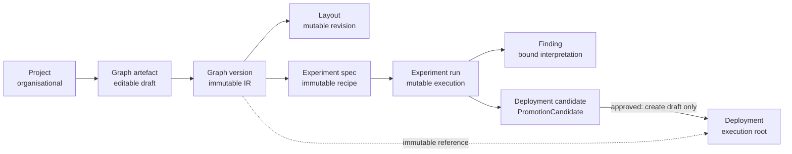

# ADR 0001: Strategy OS product-object contract

- **Status:** Accepted
- **Date:** 2026-08-03
- **Scope:** Product ownership, identity, mutability and lifecycle
- **Implements:** execution-plan slice S2.1

## Context

The Component IR already defines executable strategy identity. The editor now stores mutable
layout beside an immutable graph version. Research already persists experiment specs/runs,
findings and promotion candidates in `research.db`. Execution already has a `Deployment` root in
`paper_trader.db`.

The missing contract is how those existing records become one product without creating parallel
truths. The decision must preserve four accepted boundaries:

1. IR `(identifier, version)` remains executable graph identity.
2. Presentation state remains outside the graph hash (RFC 0001 F13).
3. Experiments and findings carry a binding derived from resolution (RFC 0001 F14).
4. The existing `Deployment` remains the only execution root.

## Rejected models

| Rejected model | Reason for rejection |
|---|---|
| Project is the execution root | A project is an editor folder. Making it executable would duplicate deployment allocation, universe, account, parameters, status and arm state. |
| Graph versions are edited in place | A result could retain the same graph identity after its executable content changed. That invalidates experiment, cache and deployment provenance. |
| Draft content or layout is stored inside a graph version | Draft mutation would rewrite history; layout mutation would change executable identity and violate F13. |
| New application-DB copies of Experiment, Finding or Deployment candidate | Research would have two ledgers with no atomic cross-database update. One side would eventually contradict the other. |
| Promotion immediately creates an active or armed deployment | Approval evidence and activation risk are separate decisions. Combining them crosses the live-runtime owner gate and bypasses the existing disarm-on-start boundary. |
| Watchlist becomes the deployment root | A watchlist selects a universe. It does not own account, allocation, immutable strategy identity, parameters, lifecycle or arm state. |
| One generic JSON `product_objects` table | It cannot enforce immutable versions, legal state transitions, required bindings or relational ownership at the database boundary. |
| Event sourcing or separate services now | The current single-owner modular application and SQLite deployment do not need independent scaling. The operational and migration cost would exceed the boundary value. |

## Accepted model

### Object identities and ownership

| Product object | Canonical identity | Owner and persistence | Mutability contract |
|---|---|---|---|
| **Project** | Opaque `project_id` | WS-04, application DB | Name, description and archive status are mutable. It owns graph artefacts but no execution state. |
| **Graph artefact** | IR `identifier` | WS-04, application DB | Owns one optimistic-concurrency draft and an append-only version sequence. Moving it between projects does not change executable identity. |
| **Graph version** | `(identifier, version)` plus recorded content address | WS-01 contract, WS-04 persistence, application DB | IR JSON is immutable after insert. The row identifier/version must equal the JSON identifier/version. Content address is derived, never caller-supplied. |
| **Layout** | `(identifier, version)` | WS-04 with WS-07 schema, application DB | Mutable sparse presentation state with a monotonic revision. It may reference only authored instance IDs and never enters an executable hash. |
| **Experiment** | Existing immutable `ExperimentSpec.id` plus `ExperimentRun.id` | WS-03, `research.db` | The product surface is the existing spec/run pair, not a third table. Spec and F14 binding inputs are immutable; run status, checkpoint and terminal outcome advance legally. |
| **Finding** | Existing research `Finding.id` | WS-03, `research.db` | A finding interprets one completed run and carries its exact F14 binding. Revision creates a successor; it never rewrites old evidence. Negative findings are first-class. |
| **Deployment candidate** | Existing `PromotionCandidate.id` | WS-03, `research.db` | This is the product's candidate record. It names one completed run, graph version and binding. Approval/rejection is terminal and records actor, reason and time. |
| **Deployment** | Existing `Deployment.id` | WS-06 with WS-02 runtime, application DB | The sole execution root. A non-legacy deployment pins an immutable graph version. Runtime configuration, universe, allocation, account, lifecycle and arm state remain here. |

`research.db` remains isolated from the execution database. Cross-database relationships use
immutable identifiers plus copied F14 binding and are validated at write boundaries; they are not
pretended to be SQL foreign keys.

### Lifecycle rules

- **Project:** `active ↔ archived`. Archive hides organisation; it never deletes graph history.
- **Graph artefact:** draft edits use `base_revision`. Publishing appends version `n + 1` in the
  same transaction that advances the artefact's current-version pointer. Published rows cannot be
  updated or deleted through normal product APIs.
- **Experiment run:** `pending → running → completed | failed`. Retry creates a new run against
  the same immutable spec; it does not reset a terminal run.
- **Finding:** `active → superseded`. The successor points back to the evidence it revises.
- **Deployment candidate:** `pending → approved | rejected`. A new decision after a terminal one
  requires a new candidate. Approval may create a **draft, disarmed** deployment only.
- **Deployment:** `draft → active ↔ paused → archived`. Activation remains an owner-gated WS-06
  operation. `armed` is orthogonal, starts false and resets on process start. An armed deployment
  or one with open/in-flight orders cannot be archived.

No cascade may delete a graph version, experiment, finding, candidate, deployment, order,
position or trade. Organisational deletion is archive or tombstone state.

## Staged persistence contract

### Application database: S2.2

1. Add `projects`, `graph_artifacts` and `graph_versions` through Alembic.
2. Seed the fixed catalogue graph as an immutable version before enforcing layout ownership.
3. Key graph versions by `(identifier, version)` and index, but do not globally uniquify, the
   content address. Two artefact lineages may begin from identical content.
4. Enforce graph-version UPDATE and DELETE refusal in SQLite, not only in ORM code.
5. Keep the existing layout tables. After catalogue seeding, quarantine layout rows that cannot
   name a real graph version, remove them from the active tables, then rebuild/add the composite
   graph-version foreign key if SQLite requires it. Downgrade restores the quarantine.
Deployment references and candidate provenance are not part of S2.2. A later WS-06-gated
migration may extend the existing `deployments` table with nullable graph identifier/version and
candidate provenance. Deployment 1 must remain null-bound and behaviour-preserving.

### Research database: later WS-03 slices

1. Extend existing experiment/candidate/finding records; do not create parallel product tables.
2. New experiment specs name the immutable graph version and derived binding inputs.
3. New findings and candidates persist the exact F14 binding. Pre-2026-08 rows stay explicitly
   legacy-unbound and cannot support comparison, approval or deployment; they are not backfilled.
4. Candidate approval writes a draft deployment only through the existing reviewed bridge. The
   research plane never writes orders, positions, capital or arm state.

### Transactions, migration and rollback

- Draft-to-version publication is one application-DB transaction.
- Candidate decision is one research-DB transaction. Draft deployment creation is a separate,
  idempotent bridge operation keyed by candidate identity; cross-database atomicity is not claimed.
- Migration tests must cover empty, current, production-shaped and downgrade paths, plus direct
  SQL attempts to update/delete immutable graph versions.
- A software rollback leaves additive tables unused. Destructive schema downgrade is permitted
  only before non-seed project/version data exists; otherwise restore from a verified backup.
- No migration rewrites or deletes capital, orders, positions or trades.

## API and workstream ownership

- WS-04 owns Project, graph artefact/version and Layout HTTP contracts.
- WS-03 owns Experiment, Finding and Deployment-candidate contracts.
- WS-06 owns candidate-to-draft bridge and Deployment lifecycle; WS-02 alone adopts deployments
  in runtime code after its separate owner gate.
- WS-01 remains the only validator, resolver, content-address and F14-binding implementation.
- WS-07 owns migrations, direct-SQL immutability and model/migration equivalence.

## Consequences

The product gets one lineage from editable intent to execution without making editor folders or
research rows executable. The cost is explicit cross-database bridge logic and a staged migration
for existing layouts and legacy research rows. That cost is accepted because it preserves plane
isolation and refuses false atomicity.
