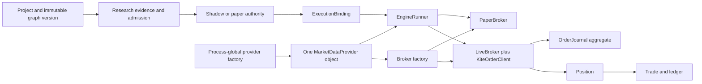

Reference: [section index](../codex-supervisor-review-2026-08-09.md). Read with its scope; this is not a new assignment.

## 1. Executive verdict

Strategy OS now has a strong graph, research-lineage, paper-authority, and single-owner trading core. It is not ready for a multi-user commercial V1, a second data provider paired with Zerodha execution, or live futures/MTF/delivery trading.

The next step is not to write the Upstox adapter. The runtime must first stop treating one process-global provider as market data, execution credentials, account state, instrument identity, and broker selection at the same time. A concurrent correction to the Upstox design note now acknowledges that the current factory cannot represent Upstox data plus Zerodha execution. This supervisor record puts explicit runtime role composition before the adapter because an unselectable adapter does not prove the intended topology.

The project should continue on the current architecture with targeted hardening. Do not rewrite the IR, research store, ledger, frontend, or runtime language. Do not add microservices, Kafka, Rust, or Kubernetes. The present bottlenecks and risks come from missing identity dimensions, collapsed lifecycle stages, process-global selection, and repeated I/O.

### Release verdicts

| Target | Verdict | Reason |
|---|---|---|
| Current single-owner paper book | **KEEP + HARDEN** | The ledger, authority gates, attribution, paper/live books, and safety tests are substantial. Close the health and journal gaps. |
| Current single-owner Zerodha live options/MIS book | **KEEP + HARDEN, owner-gated** | Real order handling is cautious, but durable intent is not mandatory and recovery is not account/deployment scoped. |
| Upstox data + Zerodha execution | **NO-GO today** | `get_provider()` returns one singleton and `make_broker(provider)` derives execution from that same object. |
| Live delivery, MTF, or futures | **NO-GO** | Delivery has no order path, MTF has accounting seams only, and live futures inherit paper methods. |
| Commercial multi-user V1 | **NO-GO** | No resource has tenant ownership, no broker connection is durable, and auth is one optional shared token. |

## 2. What changed since the older architecture

The recent provider work is real progress:

- A shared, adversarial provider conformance suite now tests capability honesty, signatures, candle structure and ordering, timezone semantics, intervals, forming-bar exclusion, dated futures, account reads, and provider provenance.
- `ProviderReadError` lets the candle path distinguish a failed read from a successful empty result.
- Futures marking resolves the exact held expiry instead of silently switching to the front month.
- `InstrumentResolver` introduces a provider mapping seam and stamps provenance.
- Capabilities replaced several provider-name checks.
- The Claude harness now has path-scoped rules, task skills, independent reviewers, and behavioural evals.

Those changes found real defects. Keep the conformance suite and expand it. The new seams do not yet make the runtime multi-connection or multi-broker.

## 3. Current architecture, as implemented

The left half has explicit immutable identity and authority. The right half still loses identity at the connection, order, and fill boundaries.

## 4. Subsystem classification

| Subsystem | Classification | Evidence and smallest correction |
|---|---|---|
| Component IR and graph schema | **KEEP** | Closed vocabularies, strict unknown-key rejection, semantic/presentation separation, content-addressed bodies. Do not add a second graph format. |
| Validation, resolution, and hashing | **KEEP + HARDEN** | Validation reports library-dependent clauses as unchecked; resolution is deterministic; canonical JSON is stable. Add implementation/runtime version to research dataset identity where it changes results. |
| Immutable graph versions | **KEEP** | `GraphVersion` verifies canonical bytes and content address, then SQLite triggers reject update and delete. |
| Platform component library | **KEEP + HARDEN** | One composition root refuses conflicting identities. It currently has one contributor. Add contributors explicitly, not by discovery. |
| Research evidence and admission | **KEEP + HARDEN** | Evidence is isolated, graph addresses are rechecked, and admission is not a lease. Correct DSR trial semantics before treating DSR as an admission-grade statistic. |
| Deployment and paper authority | **KEEP + HARDEN** | Paper authority is mode-constrained, exact-addressed, and rechecked at use. Bind deployments to durable broker accounts/connections. |
| Execution binding and strategy attribution | **KEEP + HARDEN** | Binding carries strategy source/version through fills. It does not carry connection, broker account, canonical contract, decision, intent, or order identity. |
| Provider abstraction | **REFACTOR SOON** | Market data, account reads, and instrument methods still share one base object; the process factory returns one singleton. Keep the protocols, replace the composition root. |
| Canonical instruments and provider mappings | **REFACTOR SOON** | `Instrument` still contains Kite symbology. `ResolvedInstrument.quote_key()` hardcodes `exchange:symbol`, which is not Upstox’s `SEGMENT|instrument_key` model. Make provider addressing opaque and persist mapping provenance. |
| Database model | **REFACTOR SOON** | The SQLite schema preserves the current single-process ledger well. Several large tables and models combine identities and stages. Add dimensions through migrations; do not replace the ledger wholesale. |
| Principal seam | **KEEP** | Every request can resolve a non-null principal and authorization has one policy function. |
| Authentication and tenancy | **REPLACE BEFORE COMMERCIAL V1** | One optional shared bearer token and wildcard owner policy cannot isolate customers. Projects, graphs, deployments, caches, research, and orders have no owner dimension. |
| Order lifecycle | **REFACTOR SOON** | Place-once and conservative polling are sound. Intent persistence is non-fatal, acknowledgement is not atomic with durable state, and recovery is not account-scoped. |
| Fill model | **BUILD BEFORE MULTI-BROKER** | Only aggregate `filled_qty` and `avg_price` exist. There is no immutable fill/event table, event idempotency key, or out-of-order event reducer. |
| Position and trade accounting | **KEEP + HARDEN** | Exact contract symbol/expiry, charges, paper/live book, and attribution persist. Add broker account, connection, canonical contract ID, and order/fill links. |
| Reconciliation | **KEEP + HARDEN** | The system refuses assumptions and surfaces untracked tagged orders. Scope every query by tenant, account, connection, deployment, exchange, product, and contract. |
| Backtest simulator | **KEEP + HARDEN** | Next-bar-open, adverse slippage, charges, causality, and one-lot semantics are explicit. It is not yet a portfolio or multi-leg execution simulator. |
| Backtest sweep and cache | **REFACTOR SOON** | Serial repeated provider reads dominate the 100x5 case. Cache identity omits data content, provider, code, slippage config, and tenant. |
| Runtime state and caches | **REFACTOR SOON** | Process-global provider, runner, job flag, and symbol-keyed inflight maps are safe only in the current single-process/single-account topology. |
| API and background jobs | **REFACTOR BEFORE MULTI-USER** | One daemon thread and a process-local `_running` flag do not survive restarts or support fair tenant scheduling. A durable in-process job table is enough for V1; no queue cluster is needed. |
| Deployment topology | **KEEP FOR SINGLE OWNER; DEFER SCALE WORK** | One app and SQLite are proportionate today. Move to Postgres and isolated workers when multi-user execution or multiple app replicas become real, not before. |
| Claude engineering harness | **KEEP + HARDEN** | The layering and reviewers are strong. Correct claims that role separation already exists and require tests using concrete adapter failure semantics. |
