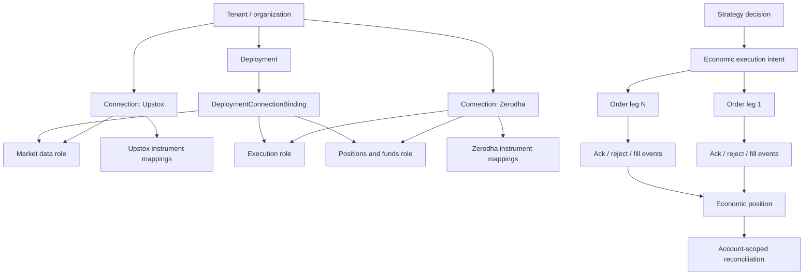

Reference: [section index](../codex-supervisor-review-2026-08-09.md). Read with its scope; this is not a new assignment.

## 6. Product and execution capability truth

| Product/route | Paper | Zerodha live | Multiple brokers | Current truth |
|---|---:|---:|---:|---|
| Long-premium options | Yes | Yes | No | The mature path. Exact option symbol, strike, expiry, fill average, charges, and strategy attribution persist. |
| Cash equity MIS | Yes | Yes | No | Product mapping and forced intraday management exist. Reconciliation still needs account/product-scoped identity. |
| Cash equity delivery (CNC) | Charges only | No | No | The code explicitly treats CNC as proof of a human order. No bot entry/lifecycle path exists. |
| MTF | Carry/P&L seams only | No | No | Configuration defaults inert. No broker capability, order product mapping, entry, funding, corporate-action, or reconciliation lifecycle exists. |
| Futures | Yes, partial foundation | No | No | Exact expiry pricing and delivery guards exist. Live open/close venue methods do not. |
| Multi-leg options/spreads | No | No | No | Signal, intent, order, position, and economic result are still close to one-leg assumptions. |
| Upstox data + Zerodha execution | No | No | No | Protocol names exist; runtime connection selection does not. |

Do not market a charge model, configuration field, or P&L helper as product support. Support begins when activation validates capabilities, contract resolution is exact, entry and exit reach the venue, fills persist, restart recovery works, and reconciliation proves the account state.

## 7. Target connection and execution model



### Minimum durable entities

1. `Tenant` or `Organization`, `User`, and membership.
2. `Connection`: provider/broker brand, owner, environment, encrypted credential reference, status, capability snapshot, and last verification.
3. `BrokerAccount`: connection, broker account ID, currency, state, and unique owner binding.
4. `ProviderInstrumentMapping`: canonical contract ID, connection/provider, opaque provider key, symbol, token, exchange, product facts, validity interval, and source version.
5. `DeploymentConnectionBinding`: deployment plus role plus selected connection/account. One role can point to a different connection from another role.
6. `Decision`: graph/strategy address, deployment, instrument/universe, completed-bar timestamp, reference market state, and reason.
7. `ExecutionIntent`: one economic action, product intent, target exposure, risk policy, client idempotency ID, and state.
8. `OrderLeg`: connection/account, canonical contract, side, quantity, type, limit/trigger, time in force, and broker request mapping.
9. `OrderEvent`: immutable request/ack/reject/cancel/status event with provider event ID and received/event timestamps.
10. `Fill`: immutable broker execution ID, quantity, price, fees, liquidity if known, and event timestamps.
11. `PositionLot` or allocation link from fills to economic position. Do not force one order or one fill to equal one position.

The existing `OrderJournal`, `Position`, and `Trade` rows remain migration sources and compatibility projections. Do not delete or rewrite money history.

## 8. Order, fill, slippage, and reconciliation rules

- Persist entry intent before submit. Refuse entry if persistence fails.
- Submit once per client intent ID. Never retry an ambiguous submit under a new ID.
- Treat broker acknowledgement, broker order status, and fills as separate facts.
- Make order-event ingestion idempotent by `(connection_id, broker_event_id)` or a deterministic event fingerprint.
- Reduce events in event time and accept duplicate/out-of-order delivery without double-booking.
- Record the decision/reference price, requested price, arrival price if available, and every fill. Slippage becomes measurable as execution price versus an explicitly named benchmark.
- Scope every recovery and reconciliation read to tenant, account, connection, deployment/book, exchange, product, and canonical contract.
- Never reconcile positions by tradingsymbol alone.
- Do not let entry journaling failure send a real entry. Preserve the stronger exit invariant with a separate emergency receipt path.
- Preserve paper/live book separation and the existing exact graph authority gate.

## 9. Backtest and research performance

### Measured 100x5 workload

A read-only benchmark ran the current single-cell simulator 500 times on 600 synthetic five-minute NIFTY bars using the default strategy:

```text
500 cells: 3.304 seconds
throughput: 151.35 cells/second
mean compute: 6.61 ms/cell
```

This benchmark excludes provider I/O, premium simulation, SQLite writes, and UI polling. It proves that the core strategy simulation is not the dominant 100x5 problem.

The sweep loops `instrument -> interval -> strategy`, then `_one()` fetches candles inside the strategy loop. The same instrument and interval are fetched again for every strategy. Kite’s historical throttle is 0.4 seconds per request, so 500 unique instrument-interval cells already have an approximate 200-second I/O floor. Two strategies can double the repeated fetch floor. Each cell also commits its result and commits progress separately.

### Proportionate correction

1. Fetch and normalize one immutable candle frame per `(provider dataset, canonical instrument, interval, window)`.
2. Content-address and persist that frame or a manifest.
3. Run all strategies and parameter candidates against the same frame.
4. Reuse pure IR node outputs by transitive `cache_id` plus frame address.
5. Batch result and progress writes.
6. Add bounded parallelism only after provider rate limits and SQLite/Postgres write limits are measured.
7. Keep Python. There is no evidence for a runtime-language rewrite.
