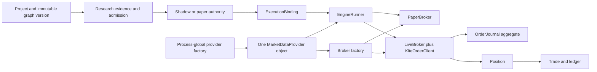
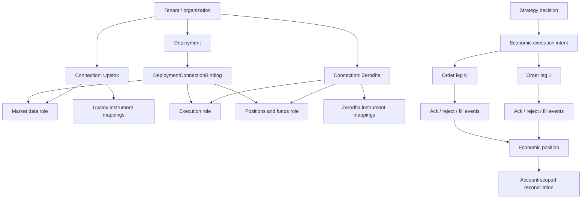

# Strategy OS supervisor review: architecture baseline and living checkpoints

**Review date:** 2026-08-09  
**Repository reviewed:** `/Users/priyanshusaraf/dev/options-trading`  
**Branch and commit:** `feat/exec-completeness` at `1ccb9d4de3640889f3b583f4424291028aed03a0`  
**Worktree state at review:** clean and equal to `origin/feat/exec-completeness`  
**Role:** product, architecture, engineering, execution-safety, research-integrity, and commercial-readiness supervisor  
**Decision rule:** reject a claim until code, persistence, tests, or measured behaviour proves it.

## Living checkpoint — 2026-08-09, `codex/execution-foundation` at `1e96b52`

The review metadata above and Sections 1–15 below are the historical baseline from
`feat/exec-completeness` at `1ccb9d4`. They remain intact because they record the evidence and
reasoning that selected the execution-first work. They are not a current-state report by
themselves. This checkpoint records what changed after that review and rejects superseded claims.

**Repository state:** the source revision is `1e96b52` before this documentation update; the
branch is not pushed or deployed. The current branch-wide gate collected 3,712 backend/research
tests: 3,706 passed and 6 expected skips. The frontend passed 223/223 tests, TypeScript checking,
and its production build. The deterministic dry run ended `LEDGER OK`; the backtest smoke
completed 16/16 cells with `SWEEP OK`; migration head remains `0014`; no live broker call or
deployment occurred.

### Current implementation delta

1. **Durable live-entry lifecycle is implemented and branch-wide verified through `9827e23`.**
   Migration `0014` adds immutable entry intents and observations. Live entry intent and
   `SUBMIT_STARTED` commit before submit; recovery scopes unresolved entries by deployment,
   account, and `kite:legacy` connection; cumulative observations book positive fill deltas only;
   protection acknowledgement and protected quantity must become durable before the booked
   watermark clears reconciliation; telemetry derives latency and adverse slippage from persisted
   facts. Legacy entry journal rows remain recoverable. Existing exits remain on the legacy
   market-order journal path.
2. **Configurable live entry order selection is implemented and branch-wide verified.**
   `f48beec` defines the approved policy, `5b3ac76` adds the closed `AUTO | MARKET | LIMIT`
   setting, `11d1db4` separates order purpose (`ENTRY | EXIT`) from side (`BUY | SELL`), and
   `1e96b52` routes effective MARKET or LIMIT instructions through live option/equity entries.
   Venue-tick normalization occurs before `ExecutionIntent` freezes `order_type` and
   `limit_price`; unresolved LIMIT orders are not repriced or resubmitted automatically.
3. **Paper/backtest LIMIT parity is still open.** `PaperBroker` accepts the live planner shape
   for interface compatibility, but paper execution does not simulate resting-limit touch,
   penetration, time-in-force, price improvement, or non-fill. The backtester remains a
   next-bar-open market-fill model with adverse cost. Cache identity does not yet include a
   versioned limit-fill model. A MARKET/LIMIT control in the live path is not evidence that paper
   or backtest results model that control.
4. **Exit routing has not changed.** Exits retain their legacy journal/recovery path and use
   market orders for risk reduction. Limit exits require a separate safety design and are not
   part of the configurable-entry slice.

### Current phase verdict

| Area | Verdict at this checkpoint | Evidence ceiling |
|---|---|---|
| Durable live entries, recovery, protection, telemetry | **COMPLETE through `9827e23`** | Entry-only; no claim about migrated exits or deployment. |
| Configurable live MARKET/LIMIT entries | **COMPLETE WITHIN THE LIVE-ENTRY SCOPE** | Backend/research, frontend, typecheck/build, ledger dry run, and sweep smoke pass. Paper/backtest LIMIT parity and release/deployment remain outside this claim. |
| Causal strategy admission | **PARTIAL** | Prefix causality and mutation tests exist; closed causal declarations and admission/runtime parity remain. |
| Content-addressed backtest cache | **CLAIM REJECTED** | Last-timestamp reuse is not candle-content identity; strategy/cost identity and complete cached artifacts remain open. |
| 100 × 5 performance | **UNPROVEN** | No operation-budget or full workload percentile gate. |
| Separate data and execution connections | **PARTIAL SEAM** | Capability tests exist; runtime still composes execution from one provider. |
| 100-user deployment | **NOT READY** | Current guarded single-owner VPS topology is not an account-worker topology. |
| Novice research product | **PARTIAL** | Existing frontend is substantial; guided novice journey and usability evidence remain open. |
| Additional brokers | **DEFERRED** | No second adapter should precede role composition. |
| Customer auth and tenancy | **DEFERRED; COMMERCIAL BLOCKER** | Single-owner bearer-token principal seam only. |

### Superseded and rejected claims

- The historical F-04 claim that a live entry can proceed without durable intent is fixed for the
  new live-entry path through `9827e23`. It remains historical evidence, not current truth.
- The historical F-05 claim that new-entry recovery is wholly unscoped is fixed for deployment,
  account, and connection in the new lifecycle. Exits and other legacy journal paths are not
  promoted to the new lifecycle by that fix.
- The historical “no immutable order/fill history” statement is now too broad. Immutable order
  observations and durable fill progress exist. A separate immutable broker-execution `Fill`
  entity and multi-leg allocation model still do not.
- “Configurable order modes are complete across live, paper, and backtest” is rejected. The
  verified slice controls live entries only.
- “Paper and backtest results reflect LIMIT execution” is rejected. They do not yet.
- “The application is ready for 100 users because a single-user deploy script exists” is
  rejected. Deploy mechanics and multi-account execution topology are different claims.
- “A second-broker-shaped capability test proves split data/execution runtime composition” is
  rejected. It proves only that shared gates no longer branch on the Kite name.

### Deployment direction without a readiness claim

The accepted path to roughly 100 users is a shared control plane plus account-isolated execution
workers, initially no more than five active accounts per worker and at least two hosts. Required
proof includes a 50-account soak, duplicate-worker fencing, crash recovery, token expiry, broker
throttling, restore, failover, and measured latency/RPO/RTO.

At roughly 1,000 users, bounded execution cells add versioned placement, resource limits,
primary/standby assignment, consistent account routing, PostgreSQL work ownership, leases, and
fencing. A message bus is justified only for notification fan-out and cache invalidation after
measurement. Per-user VPSs remain optional premium isolation. None of this topology is currently
implemented or load-proven.

The current next gates are causal admission, correct cache identity, measured 100 × 5 operation
budgets, explicit data/execution/account role bindings, and the 100-user worker/fencing soak.
Additional brokers and commercial tenancy remain deferred until those foundations exist.

## 1. Executive verdict

Strategy OS now has a strong graph, research-lineage, paper-authority, and single-owner trading core. It is not ready for a multi-user commercial V1, a second data provider paired with Zerodha execution, or live futures/MTF/delivery trading.

The next step is not to write the Upstox adapter. The runtime must first stop treating one process-global provider as market data, execution credentials, account state, instrument identity, and broker selection at the same time. A concurrent correction to the Upstox design note now acknowledges that the current factory cannot represent Upstox data plus Zerodha execution. This supervisor record puts explicit runtime role composition before the adapter because an unselectable adapter does not prove the intended topology.

The project should continue on the current architecture with targeted hardening. Do not rewrite the IR, research store, ledger, frontend, or runtime language. Do not add microservices, Kafka, Rust, or Kubernetes. The present bottlenecks and risks come from missing identity dimensions, collapsed lifecycle stages, process-global selection, and repeated I/O.

### Release verdicts

| Target | Verdict | Reason |
|---|---|---|
| Current single-owner paper book | **KEEP + HARDEN** | The ledger, authority gates, attribution, paper/live books, and safety tests are substantial. Close the health and journal gaps. |
| Current single-owner Zerodha live options/MIS book | **KEEP + HARDEN, owner-gated** | Real order handling is cautious, but durable intent is not mandatory and recovery is not account/deployment scoped. |
| Upstox data + Zerodha execution | **NO-GO today** | `get_provider()` returns one singleton and `make_broker(provider)` derives execution from that same object. |
| Live delivery, MTF, or futures | **NO-GO** | Delivery has no order path, MTF has accounting seams only, and live futures inherit paper methods. |
| Commercial multi-user V1 | **NO-GO** | No resource has tenant ownership, no broker connection is durable, and auth is one optional shared token. |

## 2. What changed since the older architecture

The recent provider work is real progress:

- A shared, adversarial provider conformance suite now tests capability honesty, signatures, candle structure and ordering, timezone semantics, intervals, forming-bar exclusion, dated futures, account reads, and provider provenance.
- `ProviderReadError` lets the candle path distinguish a failed read from a successful empty result.
- Futures marking resolves the exact held expiry instead of silently switching to the front month.
- `InstrumentResolver` introduces a provider mapping seam and stamps provenance.
- Capabilities replaced several provider-name checks.
- The Claude harness now has path-scoped rules, task skills, independent reviewers, and behavioural evals.

Those changes found real defects. Keep the conformance suite and expand it. The new seams do not yet make the runtime multi-connection or multi-broker.

## 3. Current architecture, as implemented



The left half has explicit immutable identity and authority. The right half still loses identity at the connection, order, and fill boundaries.

## 4. Subsystem classification

| Subsystem | Classification | Evidence and smallest correction |
|---|---|---|
| Component IR and graph schema | **KEEP** | Closed vocabularies, strict unknown-key rejection, semantic/presentation separation, content-addressed bodies. Do not add a second graph format. |
| Validation, resolution, and hashing | **KEEP + HARDEN** | Validation reports library-dependent clauses as unchecked; resolution is deterministic; canonical JSON is stable. Add implementation/runtime version to research dataset identity where it changes results. |
| Immutable graph versions | **KEEP** | `GraphVersion` verifies canonical bytes and content address, then SQLite triggers reject update and delete. |
| Platform component library | **KEEP + HARDEN** | One composition root refuses conflicting identities. It currently has one contributor. Add contributors explicitly, not by discovery. |
| Research evidence and admission | **KEEP + HARDEN** | Evidence is isolated, graph addresses are rechecked, and admission is not a lease. Correct DSR trial semantics before treating DSR as an admission-grade statistic. |
| Deployment and paper authority | **KEEP + HARDEN** | Paper authority is mode-constrained, exact-addressed, and rechecked at use. Bind deployments to durable broker accounts/connections. |
| Execution binding and strategy attribution | **KEEP + HARDEN** | Binding carries strategy source/version through fills. It does not carry connection, broker account, canonical contract, decision, intent, or order identity. |
| Provider abstraction | **REFACTOR SOON** | Market data, account reads, and instrument methods still share one base object; the process factory returns one singleton. Keep the protocols, replace the composition root. |
| Canonical instruments and provider mappings | **REFACTOR SOON** | `Instrument` still contains Kite symbology. `ResolvedInstrument.quote_key()` hardcodes `exchange:symbol`, which is not Upstox’s `SEGMENT|instrument_key` model. Make provider addressing opaque and persist mapping provenance. |
| Database model | **REFACTOR SOON** | The SQLite schema preserves the current single-process ledger well. Several large tables and models combine identities and stages. Add dimensions through migrations; do not replace the ledger wholesale. |
| Principal seam | **KEEP** | Every request can resolve a non-null principal and authorization has one policy function. |
| Authentication and tenancy | **REPLACE BEFORE COMMERCIAL V1** | One optional shared bearer token and wildcard owner policy cannot isolate customers. Projects, graphs, deployments, caches, research, and orders have no owner dimension. |
| Order lifecycle | **REFACTOR SOON** | Place-once and conservative polling are sound. Intent persistence is non-fatal, acknowledgement is not atomic with durable state, and recovery is not account-scoped. |
| Fill model | **BUILD BEFORE MULTI-BROKER** | Only aggregate `filled_qty` and `avg_price` exist. There is no immutable fill/event table, event idempotency key, or out-of-order event reducer. |
| Position and trade accounting | **KEEP + HARDEN** | Exact contract symbol/expiry, charges, paper/live book, and attribution persist. Add broker account, connection, canonical contract ID, and order/fill links. |
| Reconciliation | **KEEP + HARDEN** | The system refuses assumptions and surfaces untracked tagged orders. Scope every query by tenant, account, connection, deployment, exchange, product, and contract. |
| Backtest simulator | **KEEP + HARDEN** | Next-bar-open, adverse slippage, charges, causality, and one-lot semantics are explicit. It is not yet a portfolio or multi-leg execution simulator. |
| Backtest sweep and cache | **REFACTOR SOON** | Serial repeated provider reads dominate the 100x5 case. Cache identity omits data content, provider, code, slippage config, and tenant. |
| Runtime state and caches | **REFACTOR SOON** | Process-global provider, runner, job flag, and symbol-keyed inflight maps are safe only in the current single-process/single-account topology. |
| API and background jobs | **REFACTOR BEFORE MULTI-USER** | One daemon thread and a process-local `_running` flag do not survive restarts or support fair tenant scheduling. A durable in-process job table is enough for V1; no queue cluster is needed. |
| Deployment topology | **KEEP FOR SINGLE OWNER; DEFER SCALE WORK** | One app and SQLite are proportionate today. Move to Postgres and isolated workers when multi-user execution or multiple app replicas become real, not before. |
| Claude engineering harness | **KEEP + HARDEN** | The layering and reviewers are strong. Correct claims that role separation already exists and require tests using concrete adapter failure semantics. |

## 5. Findings that block the next phase

### F-01: market data and execution selection are still one object

**Severity:** critical for adapter #2 and multiple brokers  
**Files:** `app/providers/factory.py:8-30`, `app/engine/broker_factory.py:72-106`

`get_provider()` returns one process-global `MarketDataProvider`. `make_broker(provider)` asks that same object for `LIVE_EXECUTION`, copies its access token into a Kite execution client, and takes tick-size lookup from it. If an Upstox data-only provider is selected, the broker factory returns `PaperBroker`. It cannot produce Upstox data with Zerodha execution.

**Required change:** create one runtime connection composition root with explicit role bindings:

- market-data connection;
- execution connection;
- account/portfolio connection;
- instrument mapping for each connection;
- deployment-to-account binding.

A connection owns credentials and capabilities. It does not replace the existing market-data, execution, account, or resolver protocols.

**Acceptance proof:** a test configures fake Upstox-like market data and a distinct Kite-like execution connection. The selected runner reads candles from the first, sends an order through the second, and records both provenance values. Reversing or removing either binding must fail closed.

### F-02: the token latch declares recovery on `None`

**Severity:** high operational correctness  
**Files:** `app/engine/runner.py:693-707`, `app/providers/kite.py:491-499`, `tests/test_token_storm_suppression.py:71-103`

`_token_sweep_suspended()` clears the token latch after any non-throwing `get_ltp()` call. `KiteProvider.get_ltp()` catches the expired-token exception and returns `None`. The real adapter therefore clears the latch while the token remains invalid. Existing tests use a fake whose `get_ltp()` raises, so they prove different behaviour from production.

A read-only reproduction against the current method contract produced:

```text
before_bad=True
suspended=False
after_bad=False
latch=None
```

**Required change:** only clear the latch after a positive health result. A `None` quote is not proof of recovery. Add a regression test through the concrete `KiteProvider.get_ltp()` failure semantics, not a fake that raises differently.

### F-03: candle transport health and usable-data freshness are conflated

**Severity:** high operator truthfulness  
**Files:** `app/engine/runner.py:724-727`, `app/providers/kite.py:390-427`

The typed candle failure channel is correct. A successful empty or too-short frame still updates `last_scan_ok` before the runner checks whether the frame is usable. The cockpit can therefore show fresh signal data when no signal frame was evaluated.

**Required change:** keep transport success separate from usable-frame freshness. A successful empty response may clear transport failure, but it must not advance the instrument’s last usable scan timestamp. Test failed transport, valid empty history, short history, and a valid completed frame as four distinct states.

### F-04: a real order may be sent without durable intent

**Severity:** critical for real money and multi-account execution  
**Files:** `app/engine/live_broker.py:83-114`, `app/engine/order_executor.py:61-74`

The system writes a WORKING journal row before placement, which is the right order. It catches journal failure, returns `None`, and places the real order anyway. It also ignores failure to persist the broker order ID after acknowledgement. A crash can leave an accepted order with no durable record. The tag sweep alerts but does not safely adopt the order.

**Required change:**

- Entry orders must fail closed if durable intent cannot commit.
- Exit handling needs a separate safety rule because an accounting outage must not block risk reduction. Persist an emergency-exit receipt to an independent append-only fallback before or immediately after submit, then reconcile loudly.
- Persist a client intent ID before submit and send it as the broker correlation tag where supported.
- Store connection, broker, account, deployment, canonical contract, side, product intent, order type, requested quantity/price, decision/reference price, and timestamps.
- Reduce immutable broker events into order state. Do not overwrite history into one aggregate row.

### F-05: order recovery is not scoped to a book or account

**Severity:** critical once more than one deployment/account exists  
**Files:** `app/engine/live_broker.py:160-180`, `app/engine/live_broker.py:204-255`

`recover_journal()` selects every WORKING row. `journal_mark_terminal()` finds by broker order ID and status only. `_inflight` and `_pending_entries` are keyed by tradingsymbol. The same symbol in two deployments, accounts, products, or brokers collides.

**Required change:** use `(tenant, connection, broker_account, deployment, client_intent_id, broker_order_id)` for lifecycle identity. Scope recovery and terminal updates by that identity. Use canonical contract plus account for position reconciliation, never symbol alone.

### F-06: live futures can inherit simulated venue methods

**Severity:** critical if the feature flag changes  
**Files:** `app/engine/broker_protocol.py:190-202`

The guard list explicitly tolerates `LiveBroker` inheriting `open_futures_position` and `close_futures_position` from `PaperBroker`. The feature defaults off, but the runtime has a setting and tests turn it on. If it becomes reachable in live mode before the methods exist, the live broker can book a simulated position without an order.

**Required change:** add a live startup/deployment capability gate that refuses futures whenever the selected execution venue lacks both live open and close implementations. Remove the tolerated inheritance before granting the feature.

### F-07: commercial tenancy has no storage boundary

**Severity:** critical commercial blocker  
**Files:** `app/api/principal.py:75-159`, `app/db/models.py:797-876`, `app/providers/factory.py:8-30`

Auth is one optional shared bearer token. When it is absent, every caller becomes `ANONYMOUS_OWNER` with wildcard scope. `Project` has no owner. Graph identifiers are global. Deployments have an unbound `account_id` string. Provider credentials and caches are process-global.

Adding route checks cannot fix this because the queried objects carry no owner.

**Required change before customer data:** add organization/user membership, owner-scoped resource keys, durable encrypted broker connections and accounts, connection grants, and owner dimensions on every query and cache key. Backfill all existing rows to the legacy owner in one migration sequence.

### F-08: DSR breadth correction is calculated but does not decide promotion

**Severity:** high research-integrity risk  
**Files:** `research/orchestrator/run.py:406-469`

The code computes `dsr_breadth_deflated` for each validated instrument, then selects `best` by the original per-instrument `dsr`. The persisted `validated_universe` drops the breadth-deflated value. A correction that cannot change selection is telemetry, not a gate.

There is a second statistical concern. The DSR paper defines the benchmark from the variance across the tested Sharpe ratios and the number of independent trials. Current parameter optimization pools Sharpe values across repeated walk-forward folds and candidates, counts folds times candidates, then multiplies by sibling compositions while keeping the original variance. It applies that in-sample trial distribution to a pooled OOS Sharpe. Those quantities do not clearly describe one independent trial population.

**Required change:** stop treating the current DSR as admission-grade until an independent statistical review defines:

- the trial family;
- effective independent trial count;
- the Sharpe distribution whose variance feeds the expected maximum;
- whether fold repetitions are trials or dependent estimates;
- whether breadth and parameter selection require nested or combined correction;
- the exact score used to select and persist the promoted candidate.

The original paper explicitly requires unselected trials, variance across trial Sharpe estimates, and the number of independent trials. See [Bailey and López de Prado, The Deflated Sharpe Ratio](https://www.davidhbailey.com/dhbpapers/deflated-sharpe.pdf).

### F-09: backtest cache identity can return a stale answer

**Severity:** high research correctness  
**Files:** `app/backtest/cache.py:43-89`, `app/backtest/sweep.py:242-252`

The cache key uses strategy settings, window label, schema, instrument, interval, and last candle timestamp. It omits:

- the content hash of the full candle frame;
- provider/dataset identity and adjustment policy;
- first timestamp and bar count in the lookup;
- strategy implementation or graph content address;
- `backtest_slippage_pct`, even though the simulator reads it;
- charges/calendar/model version;
- tenant and connection.

A revised historical bar with the same final timestamp reuses stale metrics. A slippage setting change can also reuse stale metrics.

**Required change:** key results by an immutable dataset/frame address plus executable strategy/graph address and all economic model versions. Keep the current human window fields as metadata, not identity.

### F-10: SafePaperKite is strong but not proven at every construction site

**Severity:** medium-high safety assurance  
**Files:** `app/providers/kite.py:81-90`, `backend/scripts/reconcile_ledger.py:29-38`

`SafePaperKite` has a strong fail-closed allowlist and the live path uses a separate `LiveExecutionKite`. Tests prove the wrapper itself. They do not appear to prove that a normally constructed `KiteProvider` always holds that wrapper. Many tests bypass `__init__` and assign `.kite` directly. The ledger reconciliation script creates a raw `KiteConnect`; it currently calls only `margins`, but its type can place orders.

**Required change:** add a constructor invariant test, route read-only operational scripts through a read-only client/provider, and keep raw order-capable SDK objects out of scripts that do not place orders.

## 6. Product and execution capability truth

| Product/route | Paper | Zerodha live | Multiple brokers | Current truth |
|---|---:|---:|---:|---|
| Long-premium options | Yes | Yes | No | The mature path. Exact option symbol, strike, expiry, fill average, charges, and strategy attribution persist. |
| Cash equity MIS | Yes | Yes | No | Product mapping and forced intraday management exist. Reconciliation still needs account/product-scoped identity. |
| Cash equity delivery (CNC) | Charges only | No | No | The code explicitly treats CNC as proof of a human order. No bot entry/lifecycle path exists. |
| MTF | Carry/P&L seams only | No | No | Configuration defaults inert. No broker capability, order product mapping, entry, funding, corporate-action, or reconciliation lifecycle exists. |
| Futures | Yes, partial foundation | No | No | Exact expiry pricing and delivery guards exist. Live open/close venue methods do not. |
| Multi-leg options/spreads | No | No | No | Signal, intent, order, position, and economic result are still close to one-leg assumptions. |
| Upstox data + Zerodha execution | No | No | No | Protocol names exist; runtime connection selection does not. |

Do not market a charge model, configuration field, or P&L helper as product support. Support begins when activation validates capabilities, contract resolution is exact, entry and exit reach the venue, fills persist, restart recovery works, and reconciliation proves the account state.

## 7. Target connection and execution model



### Minimum durable entities

1. `Tenant` or `Organization`, `User`, and membership.
2. `Connection`: provider/broker brand, owner, environment, encrypted credential reference, status, capability snapshot, and last verification.
3. `BrokerAccount`: connection, broker account ID, currency, state, and unique owner binding.
4. `ProviderInstrumentMapping`: canonical contract ID, connection/provider, opaque provider key, symbol, token, exchange, product facts, validity interval, and source version.
5. `DeploymentConnectionBinding`: deployment plus role plus selected connection/account. One role can point to a different connection from another role.
6. `Decision`: graph/strategy address, deployment, instrument/universe, completed-bar timestamp, reference market state, and reason.
7. `ExecutionIntent`: one economic action, product intent, target exposure, risk policy, client idempotency ID, and state.
8. `OrderLeg`: connection/account, canonical contract, side, quantity, type, limit/trigger, time in force, and broker request mapping.
9. `OrderEvent`: immutable request/ack/reject/cancel/status event with provider event ID and received/event timestamps.
10. `Fill`: immutable broker execution ID, quantity, price, fees, liquidity if known, and event timestamps.
11. `PositionLot` or allocation link from fills to economic position. Do not force one order or one fill to equal one position.

The existing `OrderJournal`, `Position`, and `Trade` rows remain migration sources and compatibility projections. Do not delete or rewrite money history.

## 8. Order, fill, slippage, and reconciliation rules

- Persist entry intent before submit. Refuse entry if persistence fails.
- Submit once per client intent ID. Never retry an ambiguous submit under a new ID.
- Treat broker acknowledgement, broker order status, and fills as separate facts.
- Make order-event ingestion idempotent by `(connection_id, broker_event_id)` or a deterministic event fingerprint.
- Reduce events in event time and accept duplicate/out-of-order delivery without double-booking.
- Record the decision/reference price, requested price, arrival price if available, and every fill. Slippage becomes measurable as execution price versus an explicitly named benchmark.
- Scope every recovery and reconciliation read to tenant, account, connection, deployment/book, exchange, product, and canonical contract.
- Never reconcile positions by tradingsymbol alone.
- Do not let entry journaling failure send a real entry. Preserve the stronger exit invariant with a separate emergency receipt path.
- Preserve paper/live book separation and the existing exact graph authority gate.

## 9. Backtest and research performance

### Measured 100x5 workload

A read-only benchmark ran the current single-cell simulator 500 times on 600 synthetic five-minute NIFTY bars using the default strategy:

```text
500 cells: 3.304 seconds
throughput: 151.35 cells/second
mean compute: 6.61 ms/cell
```

This benchmark excludes provider I/O, premium simulation, SQLite writes, and UI polling. It proves that the core strategy simulation is not the dominant 100x5 problem.

The sweep loops `instrument -> interval -> strategy`, then `_one()` fetches candles inside the strategy loop. The same instrument and interval are fetched again for every strategy. Kite’s historical throttle is 0.4 seconds per request, so 500 unique instrument-interval cells already have an approximate 200-second I/O floor. Two strategies can double the repeated fetch floor. Each cell also commits its result and commits progress separately.

### Proportionate correction

1. Fetch and normalize one immutable candle frame per `(provider dataset, canonical instrument, interval, window)`.
2. Content-address and persist that frame or a manifest.
3. Run all strategies and parameter candidates against the same frame.
4. Reuse pure IR node outputs by transitive `cache_id` plus frame address.
5. Batch result and progress writes.
6. Add bounded parallelism only after provider rate limits and SQLite/Postgres write limits are measured.
7. Keep Python. There is no evidence for a runtime-language rewrite.

## 10. Security and tenancy threat model

The code scan found no high-severity secret pattern in `backend/app` or `frontend/src`. The harness scan reported 54 Twilio-key matches, all npm package-lock integrity strings in generated Claude worktrees. They are false positives. Local `.env` and `access_token.json` are ignored by Git, but both have mode `0644`; other local users can read them.

### Highest-priority STRIDE cases

| Threat | Current path | Risk | Required control | Owner |
|---|---|---:|---|---|
| Spoofing | Optional shared bearer token; no user identity | Critical for commercial V1 | OIDC/passkeys or managed auth, short sessions, MFA for execution, service principals | Identity |
| Elevation of privilege | Wildcard owner policy and no resource ownership | Critical | Owner columns, membership, one policy engine, deny-by-default scopes | API/security |
| Tampering | Journal writes can fail while order placement continues | Critical | Mandatory durable entry intent, append-only events, integrity checks | Execution |
| Repudiation | No immutable fill/event history or actor on many changes | High | Actor, request ID, event ID, timestamps, immutable audit log | Platform |
| Information disclosure | Tenantless objects/caches; credentials in world-readable local files | High | Tenant-keyed queries/caches, encrypted secret references, `0600`, log redaction | Platform/ops |
| Denial of service | Unbounded or heavy jobs share the process with exits | High | Bounded reads, durable job state, quotas, separate execution loop resources | Runtime |
| Cross-account execution | `Deployment.account_id` is an unbound string | Critical once accounts multiply | Foreign keys to owner-scoped broker accounts and activation-time capability checks | Execution |

Before any hosted pilot, run migrations that backfill the legacy owner, enforce ownership at the database query boundary, move secrets to a secret manager or OS key store, and separate customer research workloads from the money-management loop.

## 11. External reference decisions

Only primary repositories, official documentation, or the local review prose informed these decisions.

| Reference | Licence | Classification | Decision |
|---|---|---|---|
| Strategy OS IR, resolver, graph versions, authority | Project code | **DIRECT REUSE** | Extend the existing spine. A second graph, validator, hash, research ledger, or authority is rejected. |
| React Flow / xyflow | MIT | **DIRECT REUSE when the graph editor needs it** | Use it as a view layer. Keep layout beside semantic graph content. It is not yet a dependency. |
| QuantConnect LEAN | Apache-2.0 | **REFERENCE ONLY** | Its separate data-handler and brokerage interfaces, brokerage events, and durable security identifiers support the connection-role and canonical-contract direction. Do not import a C# trading engine into this Python product. [Repository](https://github.com/QuantConnect/Lean), [data interface](https://github.com/QuantConnect/Lean/blob/master/Common/Interfaces/IDataQueueHandler.cs), [brokerage interface](https://github.com/QuantConnect/Lean/blob/master/Common/Interfaces/IBrokerage.cs). |
| NautilusTrader | LGPL-3.0 | **REFERENCE ONLY** | Use its event-sourced order/fill, reconciliation, instrument-ID, deterministic-clock, warmup, and reset lessons. Do not introduce its engine or Rust core. [Repository](https://github.com/nautechsystems/nautilus_trader). |
| vn.py | MIT | **REFERENCE ONLY** | Its `BaseGateway` and separate order/trade events confirm thin venue gateways. Direct reuse would create a second engine and Chinese-market vocabulary. [Gateway](https://github.com/vnpy/vnpy/blob/master/vnpy/trader/gateway.py). |
| OpenAlgo | AGPL-3.0 | **REFERENCE ONLY; REJECT CODE REUSE** | Learn adapter shape, Indian broker problem catalogues, mapping, and stream recovery. Hosted AGPL obligations conflict with the commercial path. [Repository](https://github.com/marketcalls/openalgo). |
| Prefect | Apache-2.0 | **REFERENCE ONLY** | Adapt the idea of declarative cache policies. Reject a workflow dependency and graph-by-executing-Python model. |
| vectorbt | Apache-2.0 plus Commons Clause | **REJECT DEPENDENCY** | Hosted commercial restriction is incompatible. Its vectorized research ideas may inform independently written code. |
| Backtrader / Freqtrade | GPL-3.0 | **REJECT CODE REUSE** | No unsolved need justifies a second strategy/runtime model or copyleft dependency. |
| Upstox official API | Proprietary service API | **ADAPT-WRAP** | Write a thin local adapter from official contracts. Use `instrument_key`, not reusable exchange tokens; v3 historical candles have explicit unit/interval paths. [Instruments](https://upstox.com/developer/api-documentation/instruments/), [Historical V3](https://upstox.com/developer/api-documentation/v3/get-historical-candle-data/). |

Upstox’s official documentation says `instrument_key` is the stable API identifier and exchange tokens may be reused after expiry. That supports an opaque provider-mapping table and rejects `exchange:symbol` as the universal provider key.

## 12. Required modification sequence

### Slice 0: close proven correctness gaps

1. Fix token-latch recovery against concrete Kite behaviour.
2. Separate candle transport success from usable-frame freshness.
3. Add the `KiteProvider -> SafePaperKite` construction invariant and remove raw Kite SDK use from the read-only reconciliation script.
4. Make the DSR breadth score either decide promotion or remove the false claim; then schedule an independent statistical audit before admission uses DSR.

### Slice 1: runtime connection-role composition

1. Add explicit runtime role bindings for market data, execution, account, and resolver.
2. Preserve today’s one-Kite configuration as the compatibility case.
3. Change broker construction to consume the execution/account binding, not infer it from the market-data provider.
4. Prove distinct market-data and execution connections through tests.
5. Do not add Upstox code in this slice.

### Slice 2: canonical contract and provider mappings

1. Introduce canonical economic contract identity for underlying, equity, option, and future.
2. Persist provider mappings with opaque provider keys and validity/version provenance.
3. Move Kite symbology off canonical `Instrument` only after two resolvers prove equivalent Kite behaviour.
4. Make `ResolvedInstrument` carry opaque addressing; remove the universal `exchange:symbol` method.

### Slice 3: durable order and fill identity

1. Add decision, intent, order-leg, order-event, and fill entities.
2. Make entry intent persistence mandatory.
3. Add idempotent, out-of-order event reduction and account-scoped recovery.
4. Keep `Position` and `Trade` as economic/accounting projections.
5. Migrate existing journal rows without rewriting history.

### Slice 4: second data adapter

1. Implement Upstox history and quotes only.
2. Use official v3 interval semantics and provider instrument keys.
3. Pass the shared conformance contract and runtime role-selection proof.
4. Live API verification remains an owner credential gate.

### Slice 5: product lanes

1. Add typed product intent and a broker capability matrix.
2. Implement delivery with CNC lifecycle and corporate-action handling.
3. Implement live futures open/close and remove tolerated paper inheritance.
4. Implement MTF last, after funding interest, settlement, corporate actions, broker product support, and reconciliation are complete.
5. Add multi-leg intent before spreads or hedged strategies.

### Slice 6: commercial tenancy

Land tenant ownership, connection/account storage, authorization, secret management, tenant-keyed caches, job quotas, and migration backfills before a second customer receives access. This can progress beside product lanes after the shared data model is settled, but it must finish before commercial V1.

### Slice 7: research throughput and cache correctness

Content-address datasets, fetch once per instrument/interval/window, share frames across strategies, reuse pure graph nodes, batch writes, and benchmark again. Add concurrency only after the serial I/O waste is removed.

## 13. Verification gates for the next milestones

### Provider and connection gate

- One conformance suite passes every adapter and fails a dishonest adapter.
- Concrete adapter auth failures drive runtime health correctly.
- Upstox-like data plus Kite-like execution is selected in one test without provider-name branches.
- Provider mapping provenance reaches decisions, orders, fills, and reconciliation.
- Missing required capability refuses deployment activation.

### Execution gate

- Journal/intent database failure prevents entry submit.
- Ambiguous submit never causes a second order.
- Duplicate and out-of-order fill events book once.
- Partial fills across several events reconcile quantity, average, charges, and position lots.
- Restart recovery is scoped to the exact tenant/account/connection/deployment.
- `dryrun.py 700` reports `LEDGER OK` and mutation tests prove each new guard can fail.
- Live behaviour remains owner-gated.

### Tenancy gate

- Two tenants can create the same display names without global collisions.
- Tenant A cannot read, edit, deploy, backtest, connect, or reconcile Tenant B’s objects by guessed ID.
- Every cache-key audit includes tenant and connection where the answer changes.
- Broker credentials never enter logs, API payloads, research receipts, or database plaintext.

### Research gate

- Every cached result names the full dataset address, executable address, cost model, and trial family.
- The promoted candidate is selected using the correction persisted for human review.
- A statistical test fixture reproduces a known DSR calculation from the source paper.
- Search breadth increases the rejection threshold under a controlled independent-trial fixture.
- Correlated/repeated folds are not labelled independent without a documented effective-trial model.

## 14. Exact next prompt for Claude

```text
You are continuing Strategy OS in /Users/priyanshusaraf/dev/options-trading on branch
feat/exec-completeness. Read these first:

1. paper-trader/CLAUDE.md
2. .claude/rules/providers-brokers.md
3. .claude/rules/execution-safety.md
4. .claude/skills/provider-adapter/SKILL.md
5. .claude/skills/execution-safety-review/SKILL.md
6. paper-trader/docs/engineering/reference/codex-supervisor-review-2026-08-09.md
7. paper-trader/docs/engineering/reference/upstox-data-adapter-design.md

Implement one bounded slice: provider health closure plus explicit runtime connection-role
composition. Do not implement the Upstox adapter yet. Do not change graph, research, trading
logic, sizing, exits, or deployment authority.

First reject or confirm each premise from code:

- get_provider() is process-global and make_broker(provider) currently infers execution from the
  market-data provider;
- KiteProvider.get_ltp() swallows auth errors into None while EngineRunner clears the bad-token
  latch after any non-throwing probe;
- scan_signals advances last_scan_ok before proving the candle frame is usable;
- today’s one-Kite setup must behave exactly as before.

Required work:

1. Add regression tests through concrete KiteProvider semantics showing that an expired-token
   LTP probe returning None does not clear the token latch. Fix the runtime so only a positive
   health result clears it.
2. Split candle transport success from usable-frame freshness. Empty and too-short successful
   reads must not advance last_scan_ok; valid completed frames must. Preserve ProviderReadError
   handling and the auth latch.
3. Introduce one small runtime composition object that explicitly binds these roles:
   market_data, execution, account/portfolio, and instrument resolver. A connection may serve
   several roles, but role selection must remain distinct.
4. Refactor factory/broker construction to consume the explicit execution binding instead of
   deriving execution credentials, access token, and tick source from the market-data provider.
   Preserve mock/replay paper behaviour and the existing Kite live safety gates.
5. Add a proof with two distinct test connections: an Upstox-like data-only provider supplies
   candles/quotes and a Kite-like execution connection supplies the live order client. The test
   must prove the broker can be selected without granting execution capability to the data
   provider. No real credentials and no real SDK order object may be used.
6. Keep capabilities explicit and fail closed when a required role or capability is absent.
   Do not branch on provider names in shared engine code.
7. Update CONTINUE.md and the relevant architecture reference to state what is now actually
   expressible. Do not claim live Upstox verification.

Constraints:

- Use the existing MarketDataProvider, Broker/ExecutionVenue, Account/Portfolio, and
  InstrumentResolver seams. Do not create one giant Connection protocol.
- No product feature, no schema migration unless exact durable connection identity proves
  unavoidable, no multi-user implementation, no queue, no microservice, no Rust rewrite.
- SafePaperKite remains the only SDK object held by the normal Kite data provider.
- Live execution remains gated by PT_EXECUTION=live, the exact live acknowledgement, pytest
  refusal, ARM, and owner acknowledgement before deployment.
- Do not touch the live database or deploy.

Evidence before closure:

- Show each new regression test failing for the intended reason before the fix, then passing.
- Run provider conformance, token-storm, provider-read-failure, broker-factory, no-live-under-
  pytest, SafePaperKite safety, and affected full backend tests.
- Run dryrun.py 700 and backtest_smoke.py if the broker construction path changed.
- Run the full backend suite if shared factory or protocol signatures changed.
- Dispatch execution-safety-reviewer and architecture-critic on the final diff.
- Record exact commands, counts, skips, failures, branch, commit, and migration head.
- Stop for owner acknowledgement before any deployment or live-behaviour change.

Deliver a small, reviewable diff. If role composition cannot be separated without introducing a
durable Connection/Account schema, stop after the health fixes and write the minimal schema plan
with migration/backfill and compatibility details. Do not improvise a second provider singleton.
```

## 15. Review methods and evidence

- Reconstructed branch, commit, upstream equality, recent history, and diff scope from Git.
- Read provider base/capabilities/factory, Kite adapter, resolver, conformance suite, runner health, broker factory, live broker, order executor, journal models, reconciliation, and SafePaperKite call sites.
- Read IR schema, validation, resolution, hashing, runtime, platform library, graph persistence, immutable triggers, execution binding, deployments, and paper authority.
- Read research optimization, walk-forward, DSR/PBO wiring, promotion selection, evidence, and isolation guards.
- Read backtest simulator, sweep, cache, and persistence flow; ran the 500-cell compute benchmark.
- Read principal/auth, ownership-bearing models, API boundaries, and runtime globals.
- Ran the senior-security secret scanner over application, frontend, and harness source, then classified package-lock false positives without exposing secret values.
- Ran a STRIDE threat inventory for broker credentials, orders, fills, positions, projects, graph versions, and research evidence.
- Read local `multiverse-of-ideas` reviews and licence files for NautilusTrader, Prefect, and xyflow; read OpenAlgo’s AGPL licence directly.
- Consulted official GitHub repositories and official Upstox API documentation for current external references.

No product code, live configuration, database, order, deployment, Git branch, commit, or remote state was changed by this review.
